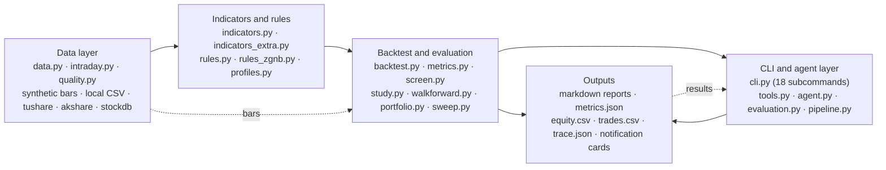
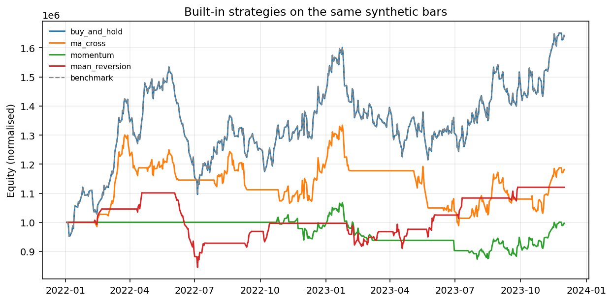
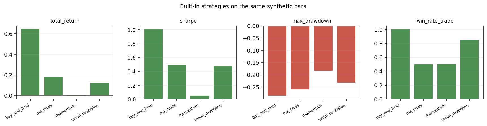
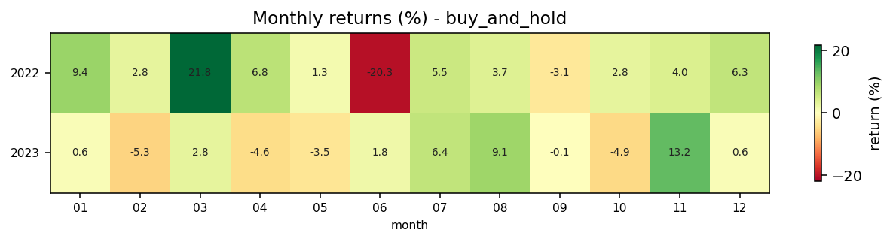

# A-Share Quant Lab (`aqlab`)

[](https://github.com/zwb-tj/ashare-quant-lab/actions/workflows/ci.yml)

**A from-scratch, reproducible A-share screening + backtesting lab**, with an explicit execution-cost model, lookahead-free signal execution, cross-sectional factor scoring, an **auditable tool-using LLM research agent**, and a testable CLI. The repository is a **clean-room original implementation**: it contains no third-party project code or curated third-party content.

> Not another "doubling strategy" repository. It is a toolkit that writes **research discipline** into code: costs must be explicit, execution must be delayed by one bar, strategies must be falsifiable, and **every number an agent states must come from a tool**.

## Highlights

- **389 pytest cases** across 32 test modules run fully offline — no network and no API key — with **87% statement coverage** enforced in CI by `--cov-fail-under=85`, on a Python 3.10 / 3.11 / 3.12 matrix, alongside **18 CLI subcommands** (11 of them exercised end to end by the same suite). The same pipeline gates **ruff** (a pinned, deliberately not-"ALL" rule set, currently zero findings) and **mypy** (32 source files, no errors).
- **Full-market scale, not a toy sample**: 5,424 symbols and **58,682 trades** over 2025-01-01 ~ 2026-09-11, every trade benchmarked against an equal-weight market index over the same holding period.
- **Negative results are quantified instead of hidden**: the published-picks backtest over 334 de-duplicated records (282 symbols) shows excess returns of -0.40% / -1.18% / -2.15% / -4.23% at 1 / 3 / 5 / 10 days, with t = -2.25 ~ -5.58.
- **One stable effect survived**: the 0AMV regime gate — open band +0.69% vs closed band -0.35%; inside the 2026-06~09 window the open band shows excess +0.78% (t=3.44) against -0.81% (t=-6.08) for the closed band.
- **Fragile effects are shown failing out of sample**: the opening "increasing volume" edge shrinks from +0.95pp to **+0.16pp** (excess +0.08%, t=1.00) once minute features are extended to 21 months / 13,492 trades, and "higher volume ratio is worse" reverses to **+0.21% (t=1.38)**.
- **Structural exit rules are measured as a negative contribution**: expected excess -0.13 ~ -0.17 (t=-4.6 ~ -6.3) while compressing average holding from 10~20 days to 3~5 days; only a -7% intraday stop cuts the left tail (worst trade -10.4% vs -22.5%).
- **Reproducibility by construction**: deterministic synthetic bars from fixed seeds, so `pytest` and the demo produce identical output on any machine, with an end-to-end demo that completes in three minutes.
- **A small dependency surface**: runtime dependencies are numpy + pandas only; the toolkit is a clean-room original implementation under MIT, with zero third-party strategy code.
- **Horizon robustness**: the IC term structure is computed in a single pass across 1/2/3/5/10/20-day horizons
  and is negative everywhere, so the finding is not a long-horizon artefact; re-running the weighting schemes
  at a 5-day holding period keeps the conclusion (all four schemes underperform the benchmark, excess -0.74%
  to -0.88%), while the ranking between schemes moves with the horizon - a sign of noise, not of edge.
- **Parameter sensitivity**: a 2x2x3 grid (lookback 60/120, single-name cap 10%/20%, equal / min-variance /
  mean-variance) over the real market shows mean-variance last in every cell (-18% to -31%, Sharpe negative,
  6.6-11.4 names, 20.6-23.8% volatility) while tightening the cap only mitigates (-31% -> -23%) and a longer
  window only mitigates further (-25%); equal weights are insensitive to both. The optimiser was also sped up
  10-72x (identical results) by cutting the internal bisection to 60 iterations and adding a convergence test.
- **The portfolio layer now runs on real data**: `aqlab portfolio --compare-methods` compares five weighting
  methods on the same signals and constraints over 1.7 years and 5,424 symbols. Mean-variance is a textbook
  failure here (6.6 names on average, -43% drawdown, -15.6% CAGR) because a 60-day expected-return estimate is
  mostly noise and the optimiser maximises that error; minimum variance keeps the lowest volatility and inverse
  volatility the best return. Annual turnover of 2,280-2,327% makes the cost line decisive.
- **State dependence**: the IC of each factor is grouped by same-day market state (equal-weight index
  momentum, cross-sectional dispersion, and the 0AMV band switch). Seven of the ten factors show a higher IC
  in the closed band than in the open band (alpha_050: +0.063, t=7.94 versus +0.038, t=3.90) while three go
  the other way, so the band switch is informative but not a universal rule. The hypothesis that high
  dispersion causes the fold-4 failure is rejected by the data - the highest-dispersion bucket actually has
  the strongest IC - so fold 4 remains mechanistically unexplained.
- **Walk-forward folds**: the single 50/50 split is upgraded to rolling folds (expanding training windows,
  direction taken from the training segment only). 12 of 74 factor-horizon combinations are robust (selected
  in at least two folds and surviving in at least 60% of them), and the per-fold survival matrix shows that
  **fold 4 (2026 Q2) failed for every factor** - these signals have whole windows where they stop working,
  something a single split can easily hide by landing on a favourable half.
- **IC significance is not tradability**: the alpha study is carried one step further into portfolios that
  enter at the *next* open, take direction only from in-sample IC sign, and charge cost on *actual* turnover.
  Of 33 factor-horizon combinations, 19 have positive gross excess and 17 positive net excess, but only
  **3 have a net-excess t above 2**; mean turnover is 0.90 and the median break-even cost is 23.4 bps, i.e.
  about half the candidates vanish at realistic costs. From 41 raw significant cells to 35 (BH) to 11
  (out-of-sample) to 3 (after costs) - each layer removes more water.
- **Statistical care on top of the alphas**: multiple-comparison control is implemented in-repo
  (Bonferroni and Benjamini-Hochberg, cross-checked element-wise against statsmodels) and the factor study
  is split into in-sample selection and out-of-sample verification. The raw count of 41 "significant"
  factor-horizon cells (5.55 false positives expected) becomes 35 under BH-FDR, 28 under Bonferroni, and
  only 11 of 16 in-sample picks survive out of sample with the same sign - the two strongest in-sample
  factors (alpha_008, alpha_001) fail out of sample, while reversal and volume-price divergence families
  (alpha_013, alpha_016, alpha_044) persist.
- **Formulaic alphas**: a clean-room Alpha101 subset (44 implemented, 22 explicitly skipped with the missing
  input named, since they need industry or market-cap data) evaluated with the same IC machinery. On the real
  full market 41 of 111 factor-horizon cells exceed |t| = 2, the strongest being reversal / volume-price
  divergence families (alpha_013 t = 8.44), which agrees with the independent reversal finding.
- **Factor research, closed loop**: `aqlab factor-backtest` turns the IC finding into portfolios (fixed weights,
  sign-flipped, trailing-IC sign and trailing-IC magnitude, weights from strictly past IC only, 20 bps round-trip
  cost, equal-weight benchmark). On the real full market all four schemes underperform the benchmark, and
  naively flipping the sign is significantly worse (-3.55% excess, t=-4.28): a negative cross-sectional IC does
  not mean the opposite portfolio makes money, because the strategy trades only the extreme tail.
- **Factor research**: `aqlab factor-ic` computes per-date Spearman IC, IC_IR and quantile spreads with an
  overlap-adjusted t statistic; on the real full market (5,424 symbols, 82 cross-sections) every factor IC is
  negative and quantile returns decrease monotonically, i.e. the sample behaves as a reversal market, the
  opposite of the shipped momentum weights.
- **Reproducibility runs on every push**: CI executes `reproduce_all.py --verify` on Python 3.12 (about 35 s), so
  every figure in this README must be regenerable by the current code. Differences against the committed files are
  reported rather than fatal there, because `bbox_inches="tight"` crops to the text extent and CI fonts differ from
  the author's machine; `--strict` enforces full identity locally, where the platform is the same.
- **Reproducibility is checkable**: `scripts/reproduce_all.py --verify` regenerates every figure into a temporary
  directory and compares it byte-for-byte with the committed copies - all eight charts match (four synthetic ones in
  about 35 seconds, four real-market ones in about 23.5 minutes). Matplotlib output here is deterministic, so
  "the figures match the code" is proved by hash rather than by eye. A test also fails if any image embedded in
  this README has no reproduction step behind it.
- **Visualisation and reporting**: one `aqlab plot` call emits equity, drawdown, strategy-comparison and monthly-return charts plus an **offline self-contained HTML report** (base64 images, zero external references, no JavaScript); matplotlib is an optional extra with a clear degradation message.
- **The agent layer is evaluated on 20 tasks covering four failure modes** (normal, abstain traps such as
  unknown symbol / invalid parameters / insufficient history / future data / memory bait, contradiction
  premises, and repeatability), scoring grounded number rate 0.981, abstain accuracy 1.000,
  contradiction accuracy 1.000, zero constraint violations and repeat consistency 1.000; a deliberately
  bad agent in the test suite has to score badly, or the yardstick itself is broken.
- **The agent layer is evaluated, not asserted**: 6 read-only JSON-Schema tools behind a bounded plan-act-observe loop with a full-step trace, scoring grounded number rate 0.900, abstain accuracy 1.000 and regression consistency 1.000 on the 5-task offline suite.

All commands, flags, file paths and numeric values below are reproduced verbatim from the source document; captured console output keeps its original numbers, with Chinese labels rendered in English for readability.

## Architecture



Data flows strictly one way: normalized bars enter the indicator/rule layer, decisive signals enter the backtest and evaluation layer, and only the CLI / agent layer may read results and produce reports, traces or notifications.

---

## Why this project exists

The three most common failure modes in quantitative research can all be blocked in advance with engineering:

1. **Lookahead** — a signal that uses the same day's close while still earning that day's return makes a backtest "profitable" by construction. This project delays every signal by one bar before execution, and ships a test that **proves the delay exists** (a signal that "peeks" at the current day's move must lose money).
2. **Cost illusion** — high-frequency signals that ignore commission and slippage look great on paper. This project models costs into returns, auditable trade by trade.
3. **Non-reproducibility** — unfixed data and randomness mean nobody else can reproduce the result. This project uses deterministic synthetic bars with fixed seeds, so `pytest` and the demo produce identical output on any machine.

## From zero (measured, not estimated)

The timings below come from an actual fresh clone in a clean virtual environment:

```bash
git clone https://github.com/zwb-tj/ashare-quant-lab.git
cd ashare-quant-lab
pip install -e ".[dev]"          # about 29 seconds

pytest -q                        # 387 cases pass in about 3 minutes, offline, no API key

# prove the README figures come from code: redraw them and compare (about 24 seconds)
python scripts/reproduce_all.py --verify

# one zero-dependency research command (synthetic data, about 6 seconds)
python -m aqlab.cli factor-ic --symbols 30 --days 500 --out output

# optional: re-run the whole flow inside a FRESH clone (clone -> install -> test -> figure check)
python scripts/verify_fresh_clone.py
```

> All four steps were run on a fresh clone: install 28.6s, tests 182.9s, figure check 23.5s, research command 6.0s.
> `--verify` requires the artefacts to be regenerable; add `--strict` to demand byte equality, which only holds
> on one platform because `bbox_inches="tight"` crops to the rendered text and fonts differ across systems.

## Quick start

```bash
# 1) Install (editable mode, with dev dependencies)
pip install -e ".[dev]"

# 2) Run the tests (216 cases, fully offline, no network / API key required)
pytest -q

# 3) Results in three minutes: built-in strategies compared on the same synthetic bars
python -m aqlab.cli demo --seed 25      # up market
python -m aqlab.cli demo --seed 7       # down market

# 4) Cross-sectional screening scores (30 synthetic symbols, weighted factor score ranking)
python -m aqlab.cli screen --symbols 30 --days 500 --top 5

# 5) Backtest a custom CSV (Chinese column names supported: 日期/开盘/最高/最低/收盘/成交量)
python -m aqlab.cli run --csv data/raw/600519.csv --strategy ma_cross --params fast=10,slow=30

# 6) Optional: download real daily bars (requires a tushare token or akshare)
export TUSHARE_TOKEN=xxxx          # Windows: set TUSHARE_TOKEN=xxxx
python -m aqlab.cli fetch --source akshare --symbol 600519 --start 2022-01-01 --end 2024-12-31 --out data/raw/600519.csv

# 7) Agent reliability evaluation (offline, no API key required)
python -m aqlab.cli eval --mode offline

# 8) Run the research agent against a real model (requires an OpenAI-compatible API key)
export AQLAB_LLM_API_KEY=sk-xxxx   # optional: AQLAB_LLM_BASE_URL / AQLAB_LLM_MODEL
python -m aqlab.cli agent --question "用 ma_cross(10,30) 回测 SYN001，给我总收益和 Sharpe" --trace output/trace.json
```

## Measured output (reproducible, synthetic bars)

**Up market (seed=25, underlying cumulative +128.5%)**

| Strategy | Total return % | Annualized % | Annualized vol % | Sharpe | Max drawdown % | Trades | Win rate % |
|:--- |---:|---:|---:|---:|---:|---:|---:|
| buy_and_hold | 128.39 | 31.98 | 28.70 | 1.111 | -28.55 | 1 | 100 |
| ma_cross | 55.80 | 16.07 | 22.34 | 0.778 | -25.92 | 12 | 50.00 |
| momentum | 9.83 | 3.20 | 14.81 | 0.287 | -18.23 | 367 | 50.95 |
| mean_reversion | 41.60 | 12.40 | 13.65 | 0.924 | -23.30 | 20 | 85.00 |

**Down market (seed=7, underlying cumulative -65.1%)**

| Strategy | Total return % | Annualized % | Annualized vol % | Sharpe | Max drawdown % | Trades | Win rate % |
|:--- |---:|---:|---:|---:|---:|---:|---:|
| buy_and_hold | -65.15 | -29.83 | 26.94 | -1.179 | -72.91 | 1 | 0.00 |
| ma_cross | -21.35 | -7.75 | 15.39 | -0.447 | -37.28 | 13 | 23.08 |
| momentum | -10.98 | -3.83 | 9.14 | -0.382 | -19.76 | 155 | 40.65 |
| mean_reversion | -45.53 | -18.46 | 19.00 | -0.979 | -53.88 | 30 | 50.00 |

**Equity, drawdown and strategy comparison (`aqlab plot`, same synthetic bars, fees and slippage included)**







> The same command also writes **`charts/report.html`**: an **offline, self-contained** report
> (images embedded as base64, styles inlined, no external reference and no JavaScript), whose header
> records the sample period, the cost parameters and the generation time. It opens offline, travels
> well when shared, and never breaks because a linked asset went away.

**How to read these two tables**

- In the bull market **no strategy beats buy-and-hold** — this is not a bug but the fact a backtest should expose: timing strategies are structurally disadvantaged in a one-way uptrend.
- In the bear market `momentum` / `ma_cross` compress the -65% drawdown to -11% / -21%, which shows their value lies in **risk control**, not return enhancement.
- An analysis that declares a strategy "effective" from a single regime is not worth trusting; **comparison across regimes** is the starting point.

## LLM / Agent research layer (v0.2, implemented)

The goal of this layer is not "letting a model chat about the market" but making **claims checkable and reliability measurable**:

```
question ──► model (plan) ──► tool calls ──► read-only tool execution ──► observations ──► ... ──► final answer
                  │                                                                                    │
                  └────────────────────────────── full-step trace ─────────────────────────────────────┘
                                                          │
                                    evaluation: are all numbers grounded in the tools?
```

**Read-only tool layer** (`aqlab/tools.py`, 6 tools, each with a JSON Schema):
`list_strategies` / `describe_data` / `get_bars` / `compute_indicator` / `run_backtest` / `screen_universe`.
The tools never write files, never place orders and never mutate state; **errors are returned as `ok=false`** (for example an unknown symbol or an invalid parameter), which forces the model to abstain instead of inventing numbers.

**Agent loop** (`aqlab/agent.py`): plan → call tools → observe → decide again, bounded by `max_steps`; every step (including tool arguments and return values) is written to a trace that can be replayed and audited. Two clients are supported: any OpenAI-compatible endpoint (implemented with the standard library only) and a `ScriptedClient` used for offline testing.

**Evaluation set** (`aqlab/evaluation.py`): 5 tasks covering three situations — normal tasks, **trap tasks** (unknown symbol / invalid parameter, where the correct behavior is abstention), and **regression tasks** (repeated runs must agree). Metric definitions:

| Metric | Meaning |
| --- | --- |
| `grounded_number_rate` | Share of numbers in the answer that can be found in tool returns (**an ungrounded number = a hallucination**) |
| `hallucinated_tasks` | Number of tasks with at least one ungrounded number |
| `abstain_accuracy` | Share of trap tasks answered with an explicit abstention |
| `tool_success_rate` | Share of tool calls returning `ok=true` (the gap comes from deliberately designed trap tasks) |
| `regression_consistency` | Share of tasks whose repeated executions agree |

**Measured offline evaluation output** (`python -m aqlab.cli eval --mode offline`):

| Metric | Value |
| --- | --- |
| tasks | 5 |
| answered_rate | 1.000 |
| tool_calls | 6 |
| tool_success_rate | 0.667 |
| numbers_total | 10 |
| grounded_number_rate | 0.900 |
| hallucinated_tasks | 1 |
| abstain_accuracy | 1.000 |
| regression_consistency | 1.000 |

Reading: the single task judged as hallucinated is the one where the script **deliberately makes the model "report 999.99% from memory"**; `[999.99]` is explicitly flagged as an ungrounded number. Both trap tasks are correctly identified as "insufficient evidence", and the regression task returns identical results on two runs. The value of this mechanism is that **any model plugged in is scored on the same ruler**, instead of a subjective claim that "this model seems reliable".

## Design principles

| Principle | How it is enforced |
| --- | --- |
| Strategies express intent only | `Strategy.positions()` returns target positions; execution, costs and delay all live in `backtest.py`, so a strategy cannot peek at the future |
| No lookahead | The engine applies `positions.shift(1)` uniformly; `tests/test_backtest.py::test_no_lookahead_oracle_loses_money` proves it by contradiction ("a peeking signal must lose money") |
| Explicit costs | `BacktestConfig(fee_bps=3, slippage_bps=2)`, with per-bar `cost` and `turnover` persisted in full |
| Reproducible | Synthetic bars are seed-determined; tests and the demo need no network |
| Explainable | The screening score is a weighted sum of cross-sectional factor z-scores, with weights in `DEFAULT_WEIGHTS` — no hidden black box |
| Fail early | Parameter validation lives in `Strategy.validate()` / `BacktestConfig.__post_init__`, and error messages point straight at the problem |

## Daily pipeline: 17:30 scoring → Feishu push (v0.3)

```bash
# Default dry-run (synthetic data validates the flow, nothing is pushed)
python -m aqlab.cli daily --symbols-count 30 --days 500 --top 8

# Use a local CSV directory as the data source
python -m aqlab.cli daily --data-dir data/raw --top 10

# Real data + real push (requires TUSHARE_TOKEN and FEISHU_WEBHOOK)
set TUSHARE_TOKEN=xxxx
set FEISHU_WEBHOOK=https://open.feishu.cn/open-apis/bot/v2/hook/xxxx
python -m aqlab.cli daily --tushare --symbols 600519.SH,000001.SZ,300750.SZ --start 2023-01-01 --push

# Override rule parameters (for example a 30-day moving average for the single needle, or 3-day confirmation for volume-price surge)
python -m aqlab.cli daily --rule needle_below_ma.ma_window=30 --rule volume_price_surge.confirm_days=3

# Windows scheduled task: run automatically and push for real at 17:30, Monday to Friday
powershell -ExecutionPolicy Bypass -File scripts\register_task.ps1
powershell -ExecutionPolicy Bypass -File scripts\run_daily.ps1 -DryRun   # trial run first
```

**Flow and artifacts**

```
17:30 ──► data source (tushare / local CSV / synthetic)
            │  each symbol is cached as CSV (an offline or repeated run does not lose yesterday's data;
            │  a fetch failure with an existing cache → use the cache and flag the degradation)
            ▼
        activity-value gate (optional hysteresis switch: fast line ≥ slow line + on → on;
        ≤ slow line + off → off; in between → hold)
            ▼
        per-symbol, per-rule scoring ─► weighted composite score (default 0.4/0.3/0.3) ─► cross-sectional ranking
            ▼
        output/daily/daily-YYYY-MM-DD.md + .json   ──►  Feishu card (unsigned custom bot)
```

**Rules are plugins; thresholds are configuration.** The repository implements generic forms with neutral naming; specific parameters (moving averages, tiers, multipliers, confirmation days, switch thresholds) are passed in through configuration:

| Generic rule | Implementation notes | Corresponding buy-side concept |
| --- | --- | --- |
| `tiered_pullback` | Pullback-to-moving-average entry point, scored by "how deep the lower shadow pierces the moving average" (tiers/tier_scores configurable to 3 tiers or more) | Tiered entry points such as B1 / B2 / B3 |
| `needle_below_ma` | Single needle probing below the moving average and recovering: long lower shadow + close back above the moving average (`ma_window` can be set to 20 / 30) | Single needle below 20 / single needle below 30 |
| `volume_price_surge` | Volume-price surge: return threshold reached + volume expansion; `confirm_days=1` for a single day, `=3` for three-day confirmation | Volume-price surge V1 / V3 |
| `ActivityValueGate` | Activity-value gate: dual moving averages of `Σ(close×volume)` + a hysteresis switch (separate on/off thresholds) | 0AMV activity value + switch rules |

> The public repository deliberately uses **neutral naming** (`tiered_pullback` / `needle_below_ma` / `volume_price_surge` / `ActivityValueGate`): rule logic and thresholds are decided by configuration, while naming and descriptions stay neutral and are not bound to any personal brand or course material.

**Measured output for this run (dry-run, synthetic universe, trading day 2023-12-01)**

```
universe 30 symbols | 🔴 activity-value gate closed (no new entry points)
rule weights: {'tiered_pullback': 0.4, 'needle_below_ma': 0.3, 'volume_price_surge': 0.3}

| rank | symbol | close | composite | triggered rules | tiered_pullback | needle_below_ma | volume_price_surge |
| 1 | SYN028 | 1145.68 | 40.1 | tiered_pullback, needle_below_ma | 1.0 | 0.0034 | 0.0 |
| 2 | SYN029 |  531.19 | 40.0 | tiered_pullback                   | 1.0 | 0.0    | 0.0 |
```

Behavioral contracts (all covered by tests): **a symbol with a composite score of 0 is never listed in the "picks"** (if fewer than top_n qualify, the report states honestly "only N triggered this run"); when the gate is closed, the watch list is still emitted but explicitly labeled "no new entry points".

## Repository layout

```
ashare-quant-lab/
├── src/aqlab/
│   ├── data.py            # data normalization (incl. Chinese column names), deterministic synthetic bars, tushare/akshare fetch + turnover + cache fallback
│   ├── indicators.py      # SMA/EMA/RSI/ATR/Donchian/z-score/volatility (all causal)
│   ├── indicators_extra.py# RSL / KDJ(9,3,3) / amplitude / white line / yellow line / BBI / Tongdaxin SMA / brick chart
│   ├── strategies.py      # built-in strategies + registry + factory
│   ├── backtest.py        # execution engine (delay, costs, position clipping), trade extraction, portfolio aggregation
│   ├── metrics.py         # return/annualized/volatility/Sharpe/Sortino/drawdown/Calmar/turnover/win rate
│   ├── screen.py          # cross-sectional factor table and weighted score ranking
│   ├── rules.py           # generic scoring rules (pullback tiers / single-needle shadow / volume-price surge) + activity-value hysteresis gate
│   ├── rules_zgnb.py      # personal rule set: B1 graded score / B2 / B3 / needle below 20-30 / volume-price V3 / brick green-to-red / 0AMV gate
│   ├── profiles.py        # rule profiles (generic|b1|b2|b3|needle_20|needle_30|volume_price_v3|zgnb_full|zgnb_brick|...)
│   ├── position.py        # position and exit: structural stop / halve at +3% / two-day BBI break / time stop / anti-premature-exit score / 3-2-2
│   ├── portfolio.py       # portfolio layer: 5 weight methods + cash buffer / single-name cap / turnover cap + share-based accounting + exposure
│   ├── study.py           # rule event study: forward N-day returns vs baseline (excess mean / excess win rate)
│   ├── walkforward.py     # rolling-window validation: signal → full trade → per-window metrics (same-holding-period benchmark)
│   ├── pipeline.py        # daily pipeline: fetch → gate → score → rank → report → push
│   ├── notify.py          # Feishu card / console dry-run notification
│   ├── report.py          # markdown report + metrics.json + equity.csv + trades.csv
│   ├── tools.py           # read-only tool layer (JSON Schema, errors returned as ok=false)
│   ├── agent.py           # bounded plan-act-observe agent loop + trace + two LLM clients
│   ├── evaluation.py      # evaluation set and metrics: groundedness / hallucination / abstention / regression consistency
│   ├── tables.py          # dependency-free markdown tables (replacing pandas.to_markdown/tabulate)
│   ├── intraday.py        # opening N-minute volume-ratio confirmation (a second gate beyond B1) + synthetic minute bars
│   ├── quality.py         # data quality audit: gaps / zero volume / jumps / multi-source cross-check / snapshot fingerprint
│   ├── sweep.py           # parameter sweep: event study + rolling window + portfolio in one grid comparison
│   └── cli.py             # .../sweep/decide/quality
├── scripts/               # run_daily.ps1 (run the current-day job), register_task.ps1 (register the 17:30 scheduled task)
├── tests/                 # 216 cases: data, indicators, backtest (incl. the no-lookahead contradiction), tools, agent, evaluation, rules, brick chart, pipeline, notification, position/exit, event study, rolling window, portfolio layer, parameter sweep
├── examples/              # offline demo scripts + example reports
├── docs/                  # architecture notes and roadmap
└── .github/workflows/     # CI: pytest across multiple Python versions
```

## Custom rule set: B1/B2/B3 · needle below 20/30 · volume-price V3 · 0AMV activity value

This layer re-implements a discretionary trading rule set as **parameterized rules + profiles** (`src/aqlab/rules_zgnb.py`, `profiles.py`), with every threshold configurable:

| Rule | Trigger definition (default values) |
| --- | --- |
| `b1_graded` | **B1 graded score (5 hard + 4 soft)**: hard — J ≤ 13; a volume spike day within the last 15 days (volume > previous day × 2); extreme volume contraction (current volume < highest of the last 15 days / 2.5); dual lines bullish (white line > yellow line and close ≥ yellow line × 0.97, requires ≥ 114 bars); prior N lows unbroken (lowest of the last 15 days ≥ lowest of the last 30 days × 0.97); excludes a large bearish bar on high volume within the last 10 days. Soft (+10 points each) — return ∈ [-2%, +1.8%], amplitude < 4%, risk-reward ≥ 3 (stop = lowest of the last 15 days × 0.97, target = highest of the last 15 days × 1.02); score = 60 + 10 × number of soft conditions passed |
| `b1_opportunity` | Simplified version (kept for compatibility): J ≤ -10; return -2%~+1.8%; amplitude ≤ 7%; cumulative turnover < 38% (enabled when a turnover column exists, otherwise skipped and noted in the report) |
| `brick_green_to_red` | Brick chart "green to red": `signal = green_to_red AND visual red bar ≥ previous visual green bar × 0.6667`; the score is graded (`min(1, strength ratio/0.6667)`, full score when the signal holds) |
| Brick filter gate `brick_filter_mask` | Gate 1 (entry): only the 1st~2nd red brick may enter; Gate 2 (no-buy): ≥ 4 red bricks always blocks entry (`use_brick_filter=True` enables it) |
| `b2_confirm` | Within 3 trading days after B1: return ≥ 4%, J < 55, and volume expansion (volume > previous day) |
| `b3_confirm` | After B2, a doji / small bearish bar (body ≤ 2%) with a flat open (\|open/previous close - 1\| ≤ 1%) |
| `needle_rsl` | Single needle below 20: RSL(3) ≤ 20 and RSL(21) ≥ 80; single needle below 30: RSL(3) < 30 and RSL(21) > 85 (`RSL(N)=100*(C-LLV(L,N))/(HHV(C,N)-LLV(L,N))`) |
| `volume_price_v3` | 2 consecutive bullish bars with consecutive new highs; 2 consecutive volume increases; same-day return 2%~6%; white line > yellow line and close ≥ yellow line × 0.97; J < 60. Score = 0.70 base + return 3~5% (+0.10) + volume > 1.5× previous day (+0.10) + J < 50 (+0.10) |
| `ActiveMarketValueGate` | 0AMV activity value: active-chip replacement decay `A_t = A_{t-1} × 0.92 × (1-turnover_t) + volume_t`, index `Σ A×close`; **open**: single day ≥ +5% (very strong) / ≥ +4% (strong) / 2 consecutive days summing ≥ +4% with no day ≤ -2.3% inside the window (normal) / 3 consecutive days summing ≥ +4% under the same condition (weaker); **close**: while holding, a single day ≤ -2.3% (sell only, no buys the next day) |

Auxiliary indicators (`src/aqlab/indicators_extra.py`): `rsl`, `kdj` (9,3,3 with J=3K-2D), `amplitude`, `white_line`=EMA(EMA(C,10),10), `yellow_line`=(MA14+MA28+MA57+MA114)/4, **`sma_tdx` (Tongdaxin `SMA(X,N,M)`)**, **`brick_chart` (brick chart)**.

### Brick chart (line-by-line equivalent implementation of the given formula)

```
VAR1A := (HHV(H,4) - C) / (HHV(H,4) - LLV(L,4)) * 100 - 90
VAR2A := SMA(VAR1A,4,1) + 100
VAR3A := (C - LLV(L,4)) / (HHV(H,4) - LLV(L,4)) * 100
VAR4A := SMA(VAR3A,6,1)
VAR5A := SMA(VAR4A,6,1) + 100
VAR6A := VAR5A - VAR2A
brick      := IF(VAR6A > 4, VAR6A - 4, 0)
visual_red := IF(brick > previous brick, brick - previous brick, 0)
visual_green := IF(brick < previous brick, previous brick - brick, 0)
green_to_red := previous visual_green > 0 AND visual_red > 0
strength_ratio := IF(green_to_red, ROUND(visual_red / previous visual_green, 2), 0)
signal := green_to_red AND visual_red >= previous visual_green * 0.6667
```

`brick_chart()` returns all intermediate columns (`var1a`…`var6a`, `brick`, `red`, `green`, `green_to_red`, `strength_ratio`, `xg`), and `brick_streaks()` additionally yields the **consecutive red/green brick counts** (the N-th red brick) used by gate 1 / gate 2. Vertical bars (red/green columns) and icons (signal marks) are drawing instructions and are not produced here; the values themselves are preserved in full.

```bash
# Run the current-day pipeline with a personal profile (0AMV gate by default, dry-run)
python -m aqlab.cli daily --profile zgnb_full --symbols-count 40 --days 600 --top 10

# Single-rule profiles
python -m aqlab.cli daily --profile needle_20      # or needle_30 / b1 / b1_brick / b2 / b3 / volume_price_v3 / brick_green_to_red
python -m aqlab.cli daily --profile zgnb_needle30  # needle below 30 + volume-price V3 combined
python -m aqlab.cli daily --profile zgnb_brick     # B1 (with brick filter) + green-to-red + V3 + needle below 20

# Parameter override + switching the gate definition
python -m aqlab.cli daily --profile b1 --rule b1_opportunity.j_max=-15 --gate activity
python -m aqlab.cli daily --profile zgnb_full --no-gate      # do not enable the market gate
```

Measured output (synthetic universe of 40 symbols, dry-run):

```
2024-04-19 | universe 40 symbols (40 available) | 🟢 gate open (hold)
- gate data definition: turnover: turnover column missing, free float estimated as 250-day max volume × 1.5
- only 3 symbols triggered rules this run (fewer than top_n=6)
rule weights: {'b1_opportunity': 0.25, 'b2_confirm': 0.2, 'b3_confirm': 0.15, 'needle_rsl': 0.15, 'volume_price_v3': 0.25}

| rank | symbol | close | composite | triggered rules | b1 | b2 | b3 | needle_rsl | v3 |
| 1 | SYN009 | 173.01 | 25.0 | b1_opportunity | 1.0 | 0 | 0 | 0 | 0 |
| 2 | SYN026 | 1079.05 | 20.0 | volume_price_v3 | 0 | 0 | 0 | 0 | 0.8 |
| 3 | SYN002 | 86.22 | 15.0 | needle_rsl | 0 | 0 | 0 | 1.0 | 0 |
```

> ⚠️ **Data dependency, stated openly**: the B1 condition "cumulative turnover < 38%" needs a real turnover rate (Tushare `daily_basic.turnover_rate`). When the data has no `turnover` column, the project **skips** that condition and records the fact in the report notes; when 0AMV turnover is missing, free float is estimated as `250-day max volume × 1.5` — an estimate, and the report says so. Exact reuse requires syncing `daily_basic` first.

## Rule evidence study: turning "it works" into checkable numbers (v0.4.2)

Anyone can write rules; **few can produce evidence**. `aqlab study` runs an event study on every rule in a profile:
it first finds every bar where the rule fired historically, then measures the **forward 1/3/5/10-day returns** at those trigger points, and finally compares them against the
"all bars in the universe" baseline — the `excess mean` / `excess win rate` is where a rule's real value shows up.

```bash
python -m aqlab.cli study --profile zgnb_full --symbols-count 40 --days 600 --horizons 1,3,5,10
```

Measured output (synthetic universe of 40 symbols / 600 trading days, excerpt):

| Rule | Holding days | Signals | Mean % | Win rate % | Baseline mean % | Baseline win rate % | Excess mean % | Excess win rate % |
| --- | ---: | ---: | ---: | ---: | ---: | ---: | ---: | ---: |
| needle_rsl | 1 | 506 | 0.44 | 59.60 | 0.27 | 56.58 | **+0.17** | **+3.03** |
| needle_rsl | 3 | 506 | 1.14 | 67.47 | 0.82 | 61.08 | **+0.32** | **+6.38** |
| needle_rsl | 10 | 506 | 3.42 | 73.52 | 2.78 | 68.84 | **+0.63** | **+4.68** |
| b1_graded | 5 | 161 | 1.44 | 66.46 | 1.38 | 64.15 | +0.07 | +2.31 |
| b1_graded | 1 | 161 | 0.20 | 49.07 | 0.27 | 56.58 | **-0.07** | **-7.51** |
| volume_price_v3 | 3 | 22 | 0.60 | 66.67 | 0.82 | 61.08 | -0.23 | +5.58 |
| b2_confirm / b3_confirm | — | **0** | — | — | — | — | — | — |

This table immediately yields three conclusions (harder than any "this feels effective"):

1. `needle_rsl` has a **stable positive excess** on this data (the excess grows with holding period) — worth further study;
2. `b1_graded` **underperforms the baseline** over the short term (1 day) and only breaks even at 5 days — evidence that it is a "structural entry point", not a short-term signal;
3. `b2_confirm`/`b3_confirm` **never fired once** (because the default precondition is the strict graded B1), which flags that "the B1 that B2/B3 depend on is too strict and must be relaxed or replaced by a simplified definition" — immediately actionable engineering information.

> Every signal-point return is a close-to-close forward return with trailing NaNs removed; when `signal count < 20` the result should not be taken seriously (the table still reports n honestly).

## Position and exit management (v0.4.3)

Screening answers "what to buy"; `position.py` answers "what to do after buying". All rules come from the same discretionary definitions and are ordered by risk-control priority:

| Priority | Rule | Definition |
| --- | --- | --- |
| 1 | Short-term hard stop (optional) | -2% (a "one-day trip" mindset) |
| 2 | Structural stop | Lowest price of the entry bar / prior low / lower edge of the platform, 3%~5% below it, and never wider than -5% |
| 3 | Break-even stop | After a +3% floating profit, a fall back to cost (profit turning into loss) exits immediately |
| 4 | First profit-taking | Halve the position at +3% away from cost |
| 5 | BBI exit | Close below BBI for 2 consecutive days ((MA3+MA6+MA12+MA24)/4) → full exit |
| 6 | Swing target | +10%~20% |
| 7 | Time stop | Held for 4-6 bars: with a +5% floating profit use the "profitable time stop", otherwise a break-even time stop |

Plus two utilities:

- **`plan_position()`** — produces a trade plan: structural stop price, three targets, risk-reward, and the **3-2-2 entry formation** (scout 30% / main force 25% / reserve 45%);
- **`defend_score()`** — the **anti-premature-exit score (5-point scale)**: close up + BBI intact + not a high-volume bearish bar + trend up + J not dead-crossing → `4-5 points hold / 3 points halve / <3 points prepare to exit`.

```bash
python -m aqlab.cli plan --symbols-count 6 --days 300 --symbol SYN001
```

```
| entry_price | stop_price | stop_pct | first_target | second_target | swing_target | risk_reward | weights |
| 120.894 | 117.094 | -0.0314 | 124.52 | 126.938 | 139.028 | 2.07 | scout 0.3 / main 0.25 / reserve 0.45 |

last 5 anti-premature-exit scores: 4 (hold) → 2 (prepare to exit) ×4
```

`simulate_exit()` / `simulate_signals()` can run complete trades from any signal series (**entry at the next day's close**, no lookahead) and return the exit reason and return per trade, which makes reconciliation against the backtest engine straightforward.

## Rolling-window validation: from signals back to performance (v0.4.4)

`aqlab study` answers "do the signals carry information"; `aqlab walkforward` goes further: it hands the signals to the position/exit rules to run **complete trades**, then aggregates them by rolling window to answer "how stable is this across phases under real position management".

```bash
python -m aqlab.cli walkforward --profile zgnb_full --symbols-count 40 --days 900 --test-days 60 --step-days 60
python -m aqlab.cli walkforward --profile zgnb_full --no-hard-stop        # experiment: disable the -2% hard stop
python -m aqlab.cli walkforward --profile needle_20 --fixed-horizon --horizon 5   # skip exit rules, hold exactly 5 bars
```

**Key design decision (the part that needed one revision)**: the per-trade comparison must be the buy-and-hold return over the **same holding period** (`same-period benchmark %`),
not "buy-and-hold % over the window length" — the latter is easily +20%, and comparing it against a 1% return from a 4-day hold is apples to oranges. The report gives both,
but only `excess %` is comparable.

Measured (synthetic universe of 40 symbols / 900 trading days / 15 windows):

| Configuration | Trades | Win rate % | Mean per-trade return % | Same-period benchmark % | **Excess %** | Windows beating the benchmark |
| --- | ---: | ---: | ---: | ---: | ---: | ---: |
| Default (with the -2% hard stop) | 814 | 57.14 | 1.17 | 1.44 | **-0.28** | 2 / 15 |
| `--no-hard-stop` (hard stop disabled) | 801 | 61.74 | 1.13 | 1.49 | **-0.36** | 1 / 15 |

**This table tells the truth, and the news is not good**: on these synthetic bars the **exit rules as a whole slightly underperform "doing nothing over the same period"**
(-0.3pp per trade); disabling the hard stop lifts the win rate from 57% to 62%, but the average return does not improve — the hard stop cuts winners while
also avoiding larger losses, so the net effect is close to break-even. Combined with the v0.4.2 conclusions (`needle_rsl` has positive excess, `b1_graded` underperforms short term),
the value proposition can be stated clearly: **the signal layer of this system has value; in a neutral market the exit layer behaves more like insurance than return enhancement**.

> Note: trade returns are **not net of commission and slippage** (real costs push this 0.3pp even lower); synthetic bars are not the real market, and
> turnover, price limits and liquidity in real data require separate treatment. Do not draw conclusions from a small number of windows or trades.

## Portfolio layer: weight optimization · exposure · turnover constraints (v0.5)

Screening produces a list; the portfolio layer decides how much to buy of each name, when to rebalance, and what rebalancing costs.

```bash
python -m aqlab.cli portfolio --profile zgnb_full --method risk_parity \
    --max-weight 0.20 --cash-buffer 0.20 --turnover-limit 0.30 --cost-bps 5 --rebalance-days 5
```

**Five weight methods** (numpy only: projected gradient + bisection projection, with no QP solver):

| Method | What it does |
| --- | --- |
| `equal` | Equal weight |
| `inverse_vol` | Inverse-volatility weighting (lower volatility gets more) |
| `risk_parity` | Risk parity: multiplicative iteration that equalizes **risk contributions** (degenerates to inverse volatility for uncorrelated assets, verified by a test) |
| `min_variance` | Long-only minimum variance (projected gradient descent) |
| `mean_variance` | Mean-variance utility maximization (annualized μ and Σ, with an adjustable risk-aversion coefficient) |

**Constraints and cost definitions (nothing hidden)**:

- **Cash buffer**: gross exposure ≤ 80% (20% held in cash);
- **Single-name cap** 20%: when `n × cap < budget` the remainder **stays in cash** instead of quietly relaxing the cap (a real bug caught while writing tests: an early implementation inflated the cap to fill the budget);
- **Turnover cap**: when one-way turnover exceeds 30%, **interpolate** toward the target (`w = prev + λ(target−prev)`) instead of hard-cutting a single name;
- **Weight drift is simulated for real**: positions are tracked by shares, so price moves generate drifting weights automatically; the rebalancing fee is `Σ|Δw| × fee rate × portfolio value`.

**Measured output** (synthetic universe of 40 symbols / 900 days, risk parity with all constraints):

```
method risk_parity | 148 rebalances | average holdings 1.34 | average turnover 0.125 | cumulative cost 0.024
net value 1.7315 | total return 73.15% | annualized 16.62% | annualized vol 5.43% | Sharpe 2.861 | max drawdown -3.94%
concentration: HHI 0.4062 / effective holdings 2.46 | style: weighted annualized vol 9.03%, momentum 2.45%, beta 0.407
> note: average holdings of 1.3 names make this a highly concentrated portfolio: single-name risk dominates
  (no holding target is imposed; the holding count is an outcome)
```

**This warning is the most useful output of the layer**: `zgnb_full` signals are so strict that 148 rebalances hold an average of only 1.3 names — no amount of portfolio optimization rescues sparse signals. Expanding the universe from 40 to 80 symbols and relaxing the single-name cap to 10% raises average holdings to 2.9 names, and that is **still not diversified enough**. The next lever is therefore the **looseness of the signal layer**, not further weight-algorithm tuning. (Performance figures on synthetic data only validate the flow and **do not represent the real market**.)

## Parameter sweep: letting data decide which parameter to relax (v0.6)

The worst approach is to change parameters by intuition. `aqlab sweep` turns this into an experiment: for every parameter combination it runs **the event study + the rolling window + the portfolio layer in sequence**, prints one comparison row per grid point, and then recommends the grid point with the highest excess subject to meeting the average-holdings target; **when no grid point qualifies, it says so explicitly**.

```bash
python -m aqlab.cli sweep --profile zgnb_full \
    --set b1_graded.j_max=13,20,30 --set b1_graded.spike_multiple=2.0,1.8 \
    --sizes 40,80 --days 900 --main-horizon 5
```

Measured (synthetic 900 days, 12 grid points, excerpt):

| Parameters | Universe | Signals | Excess mean % | Excess win rate % | Trade win rate % | Per-trade excess % | Average holdings | Qualified |
| --- | ---: | ---: | ---: | ---: | ---: | ---: | ---: | --- |
| j=13, spike=2.0 | 40 | 1063 | 0.56 | +2.26 | 57.14 | -0.28 | 1.34 | ✗ |
| j=13, spike=1.8 | 80 | 2678 | 0.10 | -2.01 | 68.06 | -0.68 | **3.04** | ✓ |
| j=20, spike=1.8 | 80 | 2826 | 0.07 | -2.27 | 67.94 | -0.67 | **3.25** | ✓ |
| j=30, spike=1.8 | 80 | 3032 | 0.08 | -2.22 | 67.07 | -0.65 | **3.51** | ✓ |

**Three conclusions, stated plainly**:

1. **Universe size is the decisive lever**: with a 40-symbol universe, no parameter setting holds more than an average of 1.71 names; only after expanding to 80 symbols do holdings generally reach ≥3. To improve diversification, expand the universe first rather than moving thresholds.
2. **Relaxing `j_max` trades quantity for quality**: 13 → 30 raises average holdings from 3.04 to 3.51, but excess mean falls from 0.10% to 0.08% and excess win rate from -2.01% to -2.22%.
3. **A different universe flips the sign**: the study excess win rate is **+2.26%** on the 40-symbol universe and becomes **-2.0% ~ -2.9%** on the 80-symbol universe, with per-trade excess negative at every grid point. The value of the sweep tool is therefore not a set of "optimal parameters" but the **exposure of how fragile the conclusions are**.

On this basis the profile **`zgnb_full_v2`** was added (`j_max=20`, `spike_multiple=1.8`), while the original `zgnb_full` is kept as a control. The portfolio report states average holdings and a concentration note honestly — **no holding target is imposed** (the holding count is an outcome, not a goal).

## Opening volume-ratio confirmation: B1 only says "oversold"; the buy decision needs incremental capital (v0.8)

B1 can only show that **a name has fallen a lot**; if no incremental capital arrives at the next open, it may keep drifting down. Entry therefore needs one more confirmation: **the volume ratio over the first N minutes after the open**.

```
volume ratio = cumulative volume in the first N minutes ÷ mean cumulative volume in the same window over the past M days (default 7 minutes / 5 days)
volume ratio ≥ threshold (default 1.0) → incremental capital present → entry allowed
volume ratio <  threshold             → no volume confirmation → stand aside
next-day minute data missing/insufficient → explicitly "cannot be determined", no guessing
```

> **Do not mix up the two volume-ratio definitions**: the one above is a **relative** measure (comparing against the same name's own recent mornings, typically with a median around 0.6~1.0);
> what market software displays is the **software definition** `intraday.standard_volume_ratio`
> = (window volume / window minutes) ÷ (average daily volume over the past N days / 240), typically 1.5~2.5 for ordinary stocks and 4+ only for unusual activity.
> When screening live with the software's "volume ratio > 3/4", use the software definition, otherwise the thresholds are not equivalent at all.

```bash
python -m aqlab.cli decide --daily-csv data/raw/600519.csv --minute-csv data/raw/600519_min.csv \
    --rule b1_graded --window-minutes 7 --baseline-days 5 --min-ratio 1.0
python -m aqlab.cli decide --daily-csv data/raw/600519.csv --rule b1_opportunity --boost 2.5   # uses synthetic minute bars when no minute data exists
```

Measured (`b1_opportunity` + synthetic minute bars):

```
rule b1_opportunity | 9 signals | 9 decision records
decision distribution: stand aside 8, buy 1
| signal_date | decision_date | volume_ratio | decision | reason |
| 2022-05-24 | 2022-05-25 | 0.877 | stand aside | opening 7-minute volume ratio 0.88 < 1, no volume confirmation |
| 2022-10-28 | 2022-10-31 | 0.661 | stand aside | opening 7-minute volume ratio 0.66 < 1, no volume confirmation |
confirmation rate: 11.1% (buys / records with a volume ratio)
```

**Causality**: the signal comes from the close of day `t`, the volume ratio from the first 7 minutes of day `t+1` — signal day and decision day are separated, so **no lookahead exists** (a test asserts that the decision day is always later than the signal day).

> ⚠️ **Boundary of synthetic data**: synthetic minute bars apply the same volume expansion across the whole period, and the volume ratio is a relative measure (each name against its own baseline), so uniform expansion does not change the ratio —
> the synthetic path can only validate the flow, **not whether the volume ratio works**. Real conclusions require real minute data (`--minute-csv`).
> This module only handles the buy/no-buy confirmation; it does not cover intraday execution details.

## Local stockdb integration: real data and small-sample volume-ratio validation (v0.8)

A local stockdb service (`127.0.0.1:7899`) provides **full-market 1-minute data from 2025-01 onward** (241 bars per day).
`aqlab stockdb-export` exports **daily + minute** data for the requested symbols into a small sample (written to `data/raw/`, which is gitignored),
after which `aqlab confirm-eval` can answer whether **B1 + the opening 7-minute volume-ratio confirmation** actually helps.

```bash
python -m aqlab.cli stockdb-export --symbols "600519,000001,300750" \
    --daily-start 20250901 --daily-end 20260807 --minute-start 20250901 --minute-end 20260807 --out data/raw
python -m aqlab.cli confirm-eval --data-dir data/raw --rule b1_graded --params "j_max=20,spike_multiple=1.8" \
    --window-minutes 7 --min-ratio 1.0 --horizons 1,3,5
```

Measured (8 large-cap blue chips; daily 2025-09~2026-08, minute 2025-09~2026-08):

| Definition | Decision | Signals | 1-day mean % | 1-day win rate % | 3-day mean % | 3-day win rate % | 5-day mean % | 5-day win rate % |
| --- | --- | ---: | ---: | ---: | ---: | ---: | ---: | ---: |
| B1 simplified (J≤-10) | **buy** (ratio ≥ 1) | 17 | -0.33 | 35.3 | -1.03 | 17.6 | -0.47 | 35.3 |
| B1 simplified | stand aside (ratio < 1) | 22 | -0.52 | 18.2 | -1.29 | 22.7 | -1.39 | 22.7 |
| B1 graded (j≤20) | **buy** | 4 | +0.91 | 75.0 | +3.16 | 75.0 | +4.22 | 75.0 |
| B1 graded | stand aside | 16 | -0.32 | 31.2 | -0.78 | 25.0 | -0.69 | 37.5 |

**The conclusion at that time (restrained)**: under both definitions the signals that passed the volume-ratio test beat those that did not, consistent in direction with the judgment that "B1 only says oversold; incremental capital must be checked";
but the sample is too small — both simplified groups are negative with a gap of only 0.19pp; the graded "buy" group has only **4 samples**, so +4.22% cannot be treated as a conclusion.

### Correction after expanding the sample: the direction is **reversed** (146 real B1 signals)

Expanding to the **146 B1 signals actually published** (2026-06-17 ~ 2026-09-10, entry at the 9:37 window price for the individual name,
with an equal-weight basket of 148 out-of-universe names bought at the decision-day open as the benchmark → excess):

| Decision | Signals | 1-day excess | 3-day excess | 5-day excess | 10-day excess | 10-day absolute return |
| --- | ---: | ---: | ---: | ---: | ---: | ---: |
| **buy** (ratio ≥ 1) | 26 | -0.83% | -2.91% | -5.29% | **-11.19%** | -12.02% |
| stand aside (ratio < 1) | 120 | -0.29% | -0.86% | -1.24% | -2.17% | -0.28% |
| Difference (Welch t) | — | -0.53pp (t=-0.57) | -2.05pp (t=-1.66) | -4.05pp (t=-1.83) | **-9.02pp (t=-3.26)** | — |

(The table above uses the **relative definition with threshold 1**. Switching to the **software definition** produces a sensible filter strength: among the 146 signals, 21 have `ratio ≥ 4`
and 13 have `≥ 5`; "ratio ≥ 4 and rising at 9:37" then leaves only 9 signals with a 10-day excess of -12.51%, still in the same reversed direction,
and across 24 combinations of window 7/8 bars × 240/241 minutes per day × direction relative to previous close/open × threshold 3/4/5, **every single one is negative**,
with a mean of -11.69%. Reproduction script: `aqlab picks-backtest ... --confirm --confirm-buckets b1`,
where the software-definition volume ratio uses `intraday.standard_volume_ratio`.)

A threshold scan shows a **monotonic reversal**: at θ=0.5/0.8/1.0/1.5 the high-ratio group's 10-day excess is -4.6 / -7.5 / -11.2 / -15.3%,
so a higher volume ratio is worse; and **no threshold turns either group's excess positive**. In the same-period sub-sample for months 6–7 (excluding the confound of the market-wide volume contraction in month 8)
the gap remains: buy -12.54% vs stand aside -4.24% (difference -8.30pp, t=-2.20).

**The current conclusion**: on this batch of real signals, "opening volume expansion" is not incremental capital chasing the name but more like **volume-driven exit while the decline continues** —
executing `buy only when ratio ≥ 1` significantly underperforms the `ratio < 1` sub-sample. The default `min_ratio` value (1.0, buy only when the test passes)
is therefore a **negative contribution in this sample** and should not be followed blindly; B1 itself also fails to beat the equal-weight basket and is only suitable as a watch list.

> Boundaries: ① the buy group has only 26 samples (months 8–9 contribute only 8 of them), so the 1–5 day between-group differences are not significant and only the 10-day difference is;
> ② the volume ratio is relative to each name's own past 5 mornings, not a market-wide measure; ③ trading costs are not included.

> Data traps (all fixed in code and covered by tests): ① stockdb `turnover` is a **percentage**, while the project uses fractions internally;
> ② reading a minute CSV must set `minute` as the index, otherwise the RangeIndex is silently interpreted as 1970 and fails quietly;
> ③ volume-ratio-confirmed returns must be counted from the **decision day** — an early version counted from the signal-day close, folding the move of the period "before any decision existed" into the return.

## Data quality audit (v0.7)

Before trusting any conclusion, check the data: monotonic/duplicate index, calendar gaps, zero-volume share, abnormal jumps (suspected unadjusted or dirty data), history length,
missing OHLC, presence of a real turnover rate, plus **multi-source cross-validation** and **data fingerprints** (first 16 hex digits of sha256).

```bash
python -m aqlab.cli quality --data-dir data/raw --max-gap-days 5 --cross-check data/raw_akshare
```

Measured (4 symbols, 1 of which had a 20-day gap injected):

```
symbols 4 | symbols with errors 0 | symbols with warnings 1 | symbols missing turnover 4
| symbol | bars | first | last | errors | warnings | issue_types  | details |
| SYN001 |  280 | 2022-01-03 | 2023-02-24 | 0 | 1 | calendar_gap | max gap 31 days, 1 gap beyond 5 days |
| 600519 |  300 | 2022-01-03 | 2023-02-24 | 0 | 0 | -            | - |
```

API: `check_frame` / `audit_universe` / `cross_source_diff` / `snapshot_hash`.
**Missing turnover is reported as info rather than an error** — because the related rules skip that condition and say so, instead of quietly substituting an estimate.

## Backtesting the picks actually published (v0.10)

Instead of re-selecting names, this reads the picks log directory (`picks_YYYY-MM-DD.json`, bucketed by b1/b2/b3/v3/n20/n30/fa/fb),
enters at the **next day's open** and exits at the close h days later, counts only the first occurrence of a symbol within 5 trading days (so continued holding is not double-counted),
and supports an **equal-weight same-period basket benchmark** — a negative return without a benchmark cannot be interpreted (when the market falls 5%, -4% is actually a win).

```bash
aqlab picks-backtest --archive ./picks_archive --buckets b1,b2,n20,n30,v3 \
  --dedupe-window 5 --horizons 1,3,5,10 \
  --benchmark-symbols 600000,600004,600009 --benchmark-sample 100 --out output
```

It outputs `picks_evaluated.csv` (with `fwd_*` / `bench_*` / `excess_*` / `entry_*`), `summary.csv` and `summary.md`.
`--confirm` additionally runs the opening volume-ratio gate (minute data required); `--benchmark-dir` reuses cached basket daily bars.
Recording the "publication day" and the "buyable day" separately is the easiest place for this module to fool itself, so the definition is written into the report header.

## Full-market B1 × market regime × exit rules (v0.11)

Three questions are answered on one pipeline at once: **does B1 work**, **is the market regime (0AMV) decisive**, and
**what are the exit rules (stop-loss/take-profit / white-yellow lines / leash / drip) worth**.

```bash
python scripts/fetch_universe_daily.py                       # full-market daily bars (~5 minutes, read directly from the local database)
aqlab universe-study --daily-dir data/universe/daily \
    --rule b1_graded --start 2025-01-01 --end 2026-09-11 \
    --exit-mode entry_low --stop-pct 0.03 --take-profit 0.15 --min-holding 3 --out output
python scripts/opening_filter_study.py                       # decision-day opening 09:30~09:37 features
```

Definition: a signal is produced at the close of day `T` → buy at the open of `T+1` → exit evaluated day by day; the benchmark is the **full-market equal-weight index** (same period, same holding period).
The 0AMV gate uses "the swing state already known at yesterday's close", so no same-day information is used.

Measured (5,424 symbols, 2025-01 ~ 2026-09, **58,682 trades**):

| Definition | Mean return % | Win rate % | Mean excess % | Excess t | Mean holding |
| --- | ---: | ---: | ---: | ---: | ---: |
| Mechanical hold 1 / 3 / 5 / 10 / 20 days | +0.13 / +0.20 / +0.30 / +0.55 / +1.42 | 47.7~50.8 | ≈0 (no alpha) | — | — |
| Structural exit only (dead cross / white-line break / drip) | +0.27 | 36.4 | -0.17 | -4.61 | 5.3 |
| Hard stop/target only (-7%/+15%) | +1.65 | 39.5 | +0.02 | 0.58 | 20.2 |
| **0AMV band open** | **+0.69** | 39.6 | -0.21 | -7.54 | 4.9 |
| **0AMV band closed** | **-0.35** | 34.3 | -0.04 | -1.18 | 3.5 |

Three conclusions (all written into `output/universe_study/结论.md`):

1. **The market regime is the most effective gate**: band open +0.69% vs band closed -0.35%; within the 2026-06~09 window the open band shows an excess of +0.78% (t=3.44) and
   the closed band -0.81% (t=-6.08).
2. **The white-line/yellow-line/leash/drip structural exit set is a negative contribution**: it compresses average holding from 10~20 days to 3~5 days and moves the excess from ≈0 to
   -0.13 ~ -0.17 (t=-4.6 ~ -6.3) — it trades "volatility" for "a certain small loss", and it does not even control the left tail
   (worst single trade -26.8% vs -22.5% for pure holding). What actually cuts the left tail is the **-7% intraday stop** (worst -10.4%, not one trade losing more than 10%).
3. **Opening features (volume ratio / early surge / volume slope) have no stable edge**: in the short window (2026-06~09, 2,597 trades) "ratio ≥ 4 + rising" shows an excess of -0.70% and
   the volume-slope Q1 low shows -0.90% (t=-3.68) → Q4 high -0.01%, which looks effective; but extending the minute features to **21 months (13,492 trades)** shrinks the
   increasing-volume advantage from +0.95pp to **+0.16pp (excess +0.08%, t=1.00)**, and "a higher volume ratio is worse" even reverses to
   **ratio ≥ 4 with an excess of +0.21% (t=1.38)**. → Conclusions about opening patterns **require out-of-sample rolling validation**; single-window results flip.

**Long-sample review (2025-01 ~ 2026-09, stratified sampling by month, 13,492 trades with opening features)**:

| Group | Trades | Mean return % | Mean excess % | Excess t |
| --- | ---: | ---: | ---: | ---: |
| All | 13,492 | +0.14 | -0.03 | -0.54 |
| Increasing volume (volume slope > 0) | 4,621 | +0.21 | +0.08 | 1.00 |
| Volume ratio ≥ 4 | 1,918 | +0.37 | +0.21 | 1.38 |
| Up relative to the previous close (top quartile) | 3,373 | +0.45 | +0.20 | 1.76 |

Only two findings hold: **the 0AMV band open (+0.58% vs band closed -0.31%)**, and **structural exits drag on returns**
(in the increasing-volume subset: exit rules +0.21% vs mechanical 10-day holding +0.62% and 20-day holding +1.42%).

> Boundaries: opening features come from stratified sampling (1,100 symbols sampled, 809 with long-period minute data retrieved), not full-market coverage;
> most excess t values are within 0.2~1.7, **not significant**; the benchmark is equal-weight (including many small caps); trading costs and the untradability implied by price limits are not modeled.

## Roadmap

- ✅ **v0.2** LLM / agent research layer: read-only tool layer + bounded agent loop + full-step trace + reliability evaluation (groundedness / hallucination / abstention).
- ✅ **v0.3** Daily pipeline: pluggable rules + activity-value hysteresis gate + tushare fetch with cache fallback + Feishu push + Windows 17:30 scheduled task.
- ✅ **v0.4.x** Custom rule set: B1 graded score (5 hard, 4 soft), needle below 20/30 (RSL definition), volume-price V3, 0AMV band gate, brick chart (incl. green-to-red signal and red-brick gates), position/exit management, rule event study, rolling-window validation, real turnover integration.
- ✅ **v0.5** Portfolio layer: five weight methods + cash buffer / single-name cap / turnover cap + share-based accounting and rebalancing costs + exposure and diversification checks.
- ✅ **v0.6** Parameter sweep: three-in-one grid comparison + qualified-point selection, empirically producing the "expand the universe before moving thresholds" conclusion and adding the `zgnb_full_v2` profile.
- ✅ **v0.7** Data quality: gaps / zero volume / abnormal jumps / multi-source cross-check / snapshot fingerprint (`aqlab quality`).
- ✅ **v0.8** Opening volume-ratio confirmation: 7-minute volume-ratio gate + decision table + causality test (`aqlab decide`), with the synthetic-data boundary written down.
- ✅ **v0.10** Picks-log backtest: next-day open entry + dedupe window + holding-period returns + **same-period equal-weight basket excess** (`aqlab picks-backtest`).
- ✅ **v0.11** Full-market verification: full-market B1 re-screening (5,424 symbols) + 0AMV band gate + exit-rule engine (stop/target, white-yellow lines, leash, drip) + opening volume features (`aqlab universe-study`).
- ✅ **v0.12** Long-sample review: 21-month stratified sampling (13,492 trades) + out-of-sample testing of opening features (conclusion: opening-pattern edges are unstable, while the 0AMV regime and the holding period are stable).
- ✅ **v0.29** State-dependence analysis: the closed 0AMV band is consistently better for every factor, and
  two plausible explanations for the fold-4 failure are rejected by the data.
- ✅ **v0.28** Walk-forward fold validation: 12 robust combinations out of 74, with fold 4 (2026 Q2) failing
  across the board.
- ✅ **v0.27** Cost check on the alpha portfolios (next-open entry, turnover-based costs, break-even cost);
  11 out-of-sample survivors shrink to 3 with a net-excess t above 2.
- ✅ **v0.26** Multiple-comparison control (Bonferroni + BH-FDR, verified against statsmodels) and an
  in-sample/out-of-sample split; 41 raw "significant" cells become 11 surviving factors, and the two strongest
  in-sample signals fail out of sample.
- ✅ **v0.25** Formulaic alphas: a clean-room Alpha101 subset with IC evaluation (`aqlab factor-ic --alpha101`).
- ✅ **v0.24** Portfolio parameter sensitivity (a 12-run grid) plus a 10-72x optimiser speed-up with identical output.
- ✅ **v0.23** Portfolio layer on real data: five weighting methods compared, degenerate cases called out, and
  unit fixes for turnover/cost display.
- ✅ **v0.22** Reproducibility check wired into CI (graded verification, exit-code policy unit-tested).
- ✅ **v0.21** Reproducibility self-check: one command regenerates every figure,
  `--verify` compares them byte-for-byte with the committed assets, and a test guards that no embedded figure
  lacks a reproduction step.
- ✅ **v0.20** Documentation close-out: the case study now covers the whole loop (screening rules, factor IC, portfolio check, horizon robustness, agent evaluation) and the architecture doc lists every module.
- ✅ **v0.19** Horizon robustness: one-pass multi-horizon IC term structure plus a short-horizon scheme re-run.
- ✅ **v0.18** Weighting-scheme backtest closing the research loop: fixed vs sign-flipped vs trailing-IC weights,
  past-IC-only weights, explicit turnover cost and an equal-weight benchmark; all schemes lose to the benchmark.
- ✅ **v0.17** Factor research: IC / IC_IR / quantile spreads with overlap-adjusted t statistics and a
  precomputed-factor fast path; the full-market run reveals reversal behaviour in the sample.
- ✅ **v0.16** Agent evaluation expanded to **20 tasks across four failure modes** (normal, abstain traps, contradiction premises, repeatability) with `contradiction_accuracy` and `constraint_violations` added.
- ✅ **v0.15** Monthly-return heatmap plus a self-contained offline HTML report, both produced by `aqlab plot`.
- ✅ **v0.14** Static analysis in CI: `ruff` (a pinned, deliberately not "ALL" rule set, currently clean) and `mypy` (32 source files, no errors) are merge gates, which surfaced and fixed implicit union types, a datasource reassignment, and two stale `type: ignore` comments.
- ✅ **v0.13** Presentation surface: CLI end-to-end tests raise statement coverage from 74% to 89% (86% after the factor-research modules landed), CI coverage gate at >=85%, an English README, and a case study including the rejected hypotheses.
- ✅ **v0.9** Visualisation and reporting: equity / drawdown / strategy-comparison / **monthly-return heatmap** charts plus a **self-contained offline HTML report** (`aqlab plot`; matplotlib is an optional extra, and the images above are produced by that command).

See [`docs/ROADMAP.md`](docs/ROADMAP.md) and [`docs/ARCHITECTURE.md`](docs/ARCHITECTURE.md) for details.

## Disclaimer

This project is for quantitative research and software engineering demonstration only. All backtests are historical simulations and **do not constitute any investment advice**; past performance does not indicate future returns. Real trading must also account for liquidity, price limits, trading halts and market impact, which this project does not model.

## License

MIT © 2026 Weibin Zhang. This repository is a clean-room original implementation.
