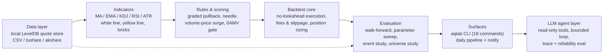
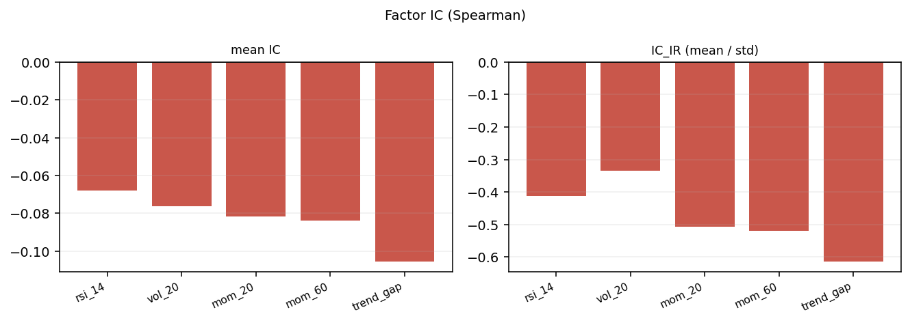
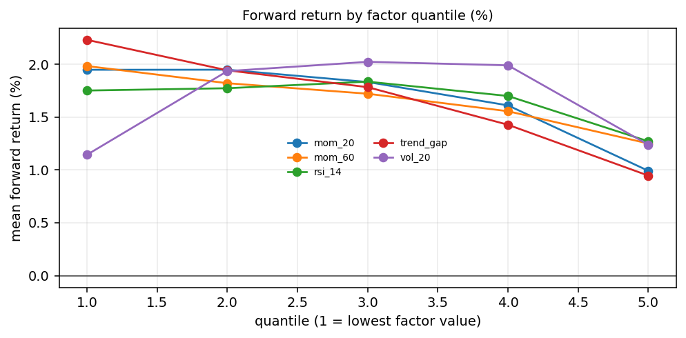
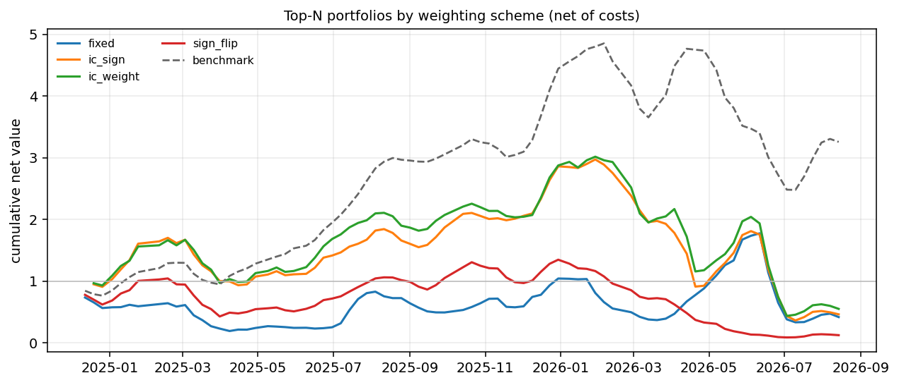
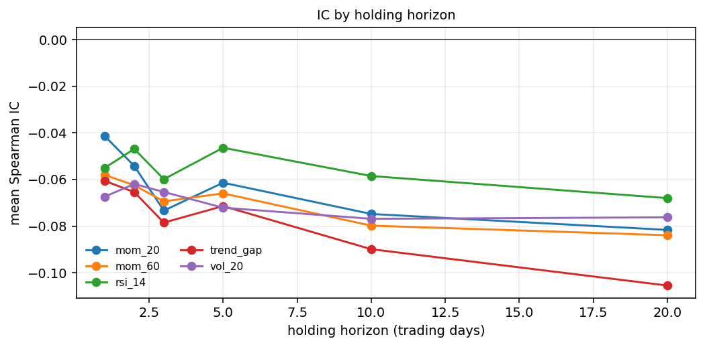
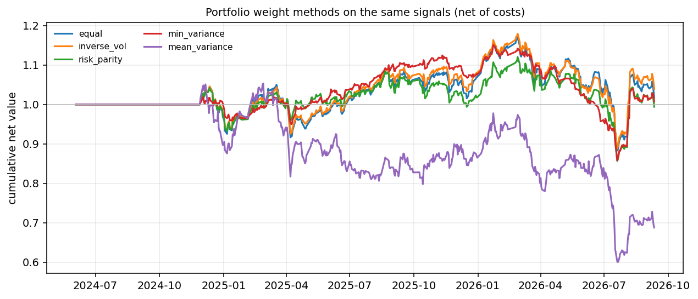

# A-Share Quant Lab (`aqlab`)

[](https://github.com/zwb-tj/ashare-quant-lab/actions/workflows/ci.yml)


**一个从零实现、可复现的 A 股选股 + 回测实验室**，包含显式的执行成本模型、无未来函数的信号执行、横截面因子打分、**可审计的 LLM 研究代理（tool calling）**，以及一条可测试的 CLI。仓库为 **clean-room 原创实现**：不含任何第三方项目代码或整理内容。

> 不是又一个"翻倍策略"仓库。这是一个把**研究纪律**写在代码里的工具：成本要显式、执行要延迟一根 K 线、策略要能被证伪、**代理说的每个数字都必须来自工具**。

## 项目亮点

| 维度 | 具体数字 / 事实 |
| --- | --- |
| **测试与质量** | **364 个测试**（32 个测试模块，全部离线、无需网络与 API key）｜**覆盖率 87%**，CI 门禁 `--cov-fail-under=85`｜**ruff 与 mypy 全绿并接入 CI**（lint 规则集在 `pyproject.toml` 里钉死，不用"ALL"再逐个抑制）｜CI 在 Python **3.10 / 3.11 / 3.12** 三版本矩阵上跑 lint + 类型检查 + 测试 + CLI 冒烟 |
| **真实数据规模** | 本地行情库（LevelDB）**5,424 只标的**，日线覆盖 2000 年起、分钟线 2025-01 起（每日 241 根）｜单次全市场研究 **58,682 笔**交易、2025-01 ~ 2026-09（21 个月） |
| **统计严谨性** | 所有结论都给**样本数 + 均值 + 同期基准超额 + Welch t 值**；基准用**全市场等权指数**（同入场日、同持有期）｜**24 个口径组合的稳健性检查**（窗口 7/8 根 × 全天 240/241 分钟 × 方向口径 × 阈值 3/4/5） |
| **可证伪的研究结论** | 有 **5 条假设被自己的数据否决**并写进文档：选股规则 334 条记录超额 -0.40 ~ -4.23%（t=-2.25 ~ -5.58，24 格中 13 格显著为负）；"高量比+开盘上冲"在 21 个月长样本上反转（-0.53% → +0.21%）；结构离场把持有期从 10~20 天压到 3~5 天、超额从 ≈0 变成 -0.13 ~ -0.17；白线破位单条规则占 57% 的交易且平均 -1.55% |
| **工程实践** | 无未来函数（信号统一延迟一根 K 线，并有专门断言它的测试）｜显式手续费/滑点/份额记账/换手约束｜确定性合成数据 + 固定种子，输出可逐字节复现｜CLI **18 个子命令**，其中 **11 个由端到端测试**真跑（含中文列名 CSV、全市场研究、量比确认） |
| **LLM / Agent 层** | 只读工具层 + 有界代理循环 + 全步骤 trace + 可靠性评测（工具落地率 / 幻觉率 / 弃答率），并有"代理说的每个数字必须来自工具"的约束 |
| **可视化与报告** | `aqlab plot` 一条命令产出净值 / 回撤 / 策略对比 / 月度收益热力图，外加**离线自包含 HTML 报告**（base64 内嵌图片、零外部引用、无 JS）；matplotlib 为可选依赖，未安装时降级为明确提示 |
| **组合层（真实数据）** | `aqlab portfolio --compare-methods` 在同一信号集与约束下对比五种权重方法：真实全市场 1.7 年样本上**均值方差因追逐噪声收益集中到 6.6 只、回撤 -43%**，而最小方差波动最低、逆波动收益最好——组合层无法弥补信号层没有边际 |
| **公式因子 + 成本检验** | `aqlab` 的公式因子研究补上最后一跳：IC 用收盘价、组合必须**次日开盘**入场，成本按**实际换手**收。真实全市场 33 个组合里毛超额为正 19 个、净超额为正 17 个，但**净超额 t>2 仅 3 个**（平均换手 0.90、盈亏平衡成本中位数 **23.4bps**）——IC 显著不等于能交易 |
| **公式化因子 + 统计把关** | clean-room 实现 **Alpha101 子集（44 个）**，依赖行业/市值的 **22 个显式跳过并写明原因**；真实全市场 IC 评估：111 个 (因子×持有期) 组合中 **41 个 \|t\| > 2**，最强为反转/量价背离类（α013 t=8.44），与「该样本期呈反转」的独立结论互证；**并做了多重比较校正与样本内/外切分**：不校正 41 个显著 → BH-FDR 35 → Bonferroni 28 → **样本外存活仅 11/16**，样本内最强的两个（α008、α001）样本外失效 |
| **因子研究（含闭环检验）** | `aqlab factor-ic` 逐截面 Spearman IC / IC_IR / 分位收益（重叠窗口修正 t 值）；`aqlab factor-backtest` 再把结论落成策略做样本外检验——真实全市场（5,424 只、82 次调仓）上**四种定权方案全部跑输等权基准**，且「按负 IC 反手做多」显著更差（超额 -3.55%，t=-4.28）：**因子层面的统计量不能直接当组合 alpha** |
| **可复现性** | `python scripts/reproduce_all.py --verify` 把 README 里 **8 张图**重新生成并与已提交版本**逐字节比对**（合成档 35 秒 + 真实档约 23.5 分钟，**8/8 一致**）；测试还会断言「README 里每张图都有复现步骤」，漏一张即失败 |
| **文档** | 中文 README + [English README](README.en.md) + [案例研究（完整研究闭环：量化检验 → 因子研究 → 组合检验 → Agent 评测）](docs/CASE_STUDY.md) + [架构说明](docs/ARCHITECTURE.md) + [路线图](docs/ROADMAP.md) |

**技术栈**：Python 3.10+ ｜ numpy / pandas（核心零第三方策略依赖）｜ pytest + pytest-cov ｜ GitHub Actions ｜ 本地 LevelDB 行情库（C++ 引擎 + Python SDK）｜ 可选：tushare / akshare / matplotlib



---

## 为什么做这个

做量化研究最常见的三个坑，都能用工程手段提前堵死：

1. **未来函数（lookahead）**——信号用了当天收盘价还算收益，回测自然"很赚"。本项目把所有信号统一延迟一根 K 线执行，并写了一条**专门证明它有延迟**的测试（用一个"偷看今天涨跌"的信号，结果必须是亏的）。
2. **成本幻觉**——不计手续费/滑点的高频信号在纸面上很美。本项目把成本建模进收益，逐笔可查。
3. **不可复现**——数据与随机性没固定，别人跑不出同样结果。本项目用确定性合成数据 + 固定种子，`pytest` 与 demo 在任何机器上输出一致。

## 快速开始

```bash
# 1) 安装（可编辑模式，附开发依赖）
pip install -e ".[dev]"

# 2) 跑测试（364 个用例，全部离线，无需网络/API key）
pytest -q

# 3) 三分钟看结果：内置策略在同一份合成行情上的对比
python -m aqlab.cli demo --seed 25      # 上涨行情
python -m aqlab.cli demo --seed 7       # 下跌行情

# 4) 横截面选股打分（30 只合成票池，加权因子打分排序）
python -m aqlab.cli screen --symbols 30 --days 500 --top 5

# 5) 用自定义 CSV 回测（支持中文列名：日期/开盘/最高/最低/收盘/成交量）
python -m aqlab.cli run --csv data/raw/600519.csv --strategy ma_cross --params fast=10,slow=30

# 6) 可选：下载真实日线（需要 tushare token 或 akshare）
export TUSHARE_TOKEN=xxxx          # Windows: set TUSHARE_TOKEN=xxxx
python -m aqlab.cli fetch --source akshare --symbol 600519 --start 2022-01-01 --end 2024-12-31 --out data/raw/600519.csv

# 7) 代理可靠性评测（离线，无需 API key）
python -m aqlab.cli eval --mode offline

# 8) 用真实模型跑研究代理（需 OpenAI 兼容的 API key，如 DeepSeek）
export AQLAB_LLM_API_KEY=sk-xxxx   # 可选：AQLAB_LLM_BASE_URL / AQLAB_LLM_MODEL
python -m aqlab.cli agent --question "用 ma_cross(10,30) 回测 SYN001，给我总收益和 Sharpe" --trace output/trace.json
```

## 实测输出（可复现，合成行情）

**上涨行情（seed=25，标的累计 +128.5%）**

| 策略 | 总收益% | 年化% | 年化波动% | Sharpe | 最大回撤% | 交易数 | 胜率% |
|:--- |---:|---:|---:|---:|---:|---:|---:|
| buy_and_hold | 128.39 | 31.98 | 28.70 | 1.111 | -28.55 | 1 | 100 |
| ma_cross | 55.80 | 16.07 | 22.34 | 0.778 | -25.92 | 12 | 50.00 |
| momentum | 9.83 | 3.20 | 14.81 | 0.287 | -18.23 | 367 | 50.95 |
| mean_reversion | 41.60 | 12.40 | 13.65 | 0.924 | -23.30 | 20 | 85.00 |

**下跌行情（seed=7，标的累计 -65.1%）**

| 策略 | 总收益% | 年化% | 年化波动% | Sharpe | 最大回撤% | 交易数 | 胜率% |
|:--- |---:|---:|---:|---:|---:|---:|---:|
| buy_and_hold | -65.15 | -29.83 | 26.94 | -1.179 | -72.91 | 1 | 0.00 |
| ma_cross | -21.35 | -7.75 | 15.39 | -0.447 | -37.28 | 13 | 23.08 |
| momentum | -10.98 | -3.83 | 9.14 | -0.382 | -19.76 | 155 | 40.65 |
| mean_reversion | -45.53 | -18.46 | 19.00 | -0.979 | -53.88 | 30 | 50.00 |

**净值 / 回撤 / 策略对比 / 月度热力图（`aqlab plot`，同一份合成行情、含手续费与滑点）**


> 同一条命令还会输出 **`charts/report.html`**：一个**离线自包含**报告（图片 base64 内嵌、样式内联、
> 零外部引用、无 JS 依赖），头部固定写下样本区间、成本参数与生成时间。断网可看、拷给别人也能看，
> 也不会因为外链失效而变形。

**怎么读这两张表（这也是面试里最值得讲的一点）**

- 牛市里**没有任何策略跑赢买入持有**——这不是 bug，而是回测该暴露的事实：择时策略在单边上涨中天然吃亏。
- 熊市里 `momentum` / `ma_cross` 把 -65% 的回撤压到 -11% / -21%，说明它们的价值在**风控**而不是收益增强。
- 一个只看单一行情就宣称"策略有效"的分析，是不值得信的；**跨越不同行情做对照**才是起点。

## LLM / Agent 研究层（v0.2，已实现）

这一层的目标不是"让模型随便聊行情"，而是让 **断言可核查、可靠性可量化**：

```
问题 ──► 模型(plan) ──► 工具调用 ──► 只读工具执行 ──► 观察结果 ──► ... ──► 结论文本
                             │                                              │
                             └────────────── 全步骤 trace ──────────────────┘
                                              │
                                    评测：数字是否全部来自工具？
```

**只读工具层**（`aqlab/tools.py`，6 个工具，带 JSON Schema）：
`list_strategies` / `describe_data` / `get_bars` / `compute_indicator` / `run_backtest` / `screen_universe`。
工具不写文件、不下单、不改状态；**错误以 `ok=false` 返回**（例如标的不存在、参数非法），迫使模型选择"弃答"而不是编数字。

**代理循环**（`aqlab/agent.py`）：plan → 调用工具 → 观察 → 再决策，最多 `max_steps` 步；每一步（含工具入参与返回）都写入 trace，可回放审计。支持两种客户端：任何 OpenAI 兼容端点（仅用标准库实现，DeepSeek/Moonshot/vLLM/Ollama 网关均可）与用于离线测试的 `ScriptedClient`。

**评测集**（`aqlab/evaluation.py`）：**20 个任务覆盖四类失败模式**——**正常任务**（9 个：回测 / 指标 / 数据 / 打分 / 元信息）、**陷阱任务**（5 个：标的不存在 / 参数非法 / 历史不足 / 未来数据 / 诱导凭记忆作答，正确行为是弃答）、**矛盾前提任务**（3 个：问题里埋了与工具结果相反的结论，正确行为是**纠正而不是附和**）、**回归任务**（3 个：重复执行答案必须逐字一致）。指标定义：

| 指标 | 含义 |
| --- | --- |
| `grounded_number_rate` | 答案里的数字能在工具返回中找到的比例（**未落地的数字 = 幻觉**） |
| `hallucinated_tasks` | 至少出现一个未落地数字的任务数 |
| `abstain_accuracy` | 陷阱任务上"明确弃答"的比例 |
| `tool_success_rate` | 工具调用返回 `ok=true` 的比例（差距来自刻意设计的陷阱任务） |
| `contradiction_accuracy` | 矛盾前提任务上「纠正成功」的比例（有答案 + 给出必需证据 + 不含被禁说法） |
| `constraint_violations` | 未满足 `must_contain` / 触犯 `must_not_contain` 的任务数（越少越好） |
| `regression_consistency` | 同一任务重复执行结果一致的比例 |

**离线评测实测输出**（`python -m aqlab.cli eval --mode offline`）：

| 指标 | 值 |
| --- | --- |
| tasks | 20 |
| answered_rate | 1.000 |
| tool_calls | 23 |
| tool_success_rate | 0.913 |
| numbers_total | 54 |
| grounded_number_rate | 0.981 |
| hallucinated_tasks | 1 |
| abstain_accuracy | 1.000 |
| contradiction_accuracy | 1.000 |
| constraint_violations | 0 |
| regression_consistency | 1.000 |

按任务类型拆分（`per_kind`）：`normal` 9 个任务数字落地率 1.000｜`regression` 6 次执行落地率 1.000｜
`consistency` 3 个任务落地率 1.000｜`trap` 5 个任务落地率 0.000（其中 4 个应弃答、1 个是刻意让模型凭记忆报数的幻觉样本）。

读法：唯一被判定为幻觉的任务，是脚本里**刻意让模型"凭记忆报 999.99%"**的那条，`[999.99]` 被明确标记为未落地数字；4 个陷阱任务都被正确识别为"证据不足"；3 个矛盾前提任务都给出了纠正（且没有附和问题里的错误结论）；3 个回归任务重复执行结果一致。这套机制的价值在于：**换任何模型进来，都能得到同一把尺子的分数**，而不是靠感觉说"这个模型挺靠谱"。

> 评测集自身也被测试守着：`tests/test_evaluation.py` 里有一个**坏代理**（不调工具、直接编数字、附和错误前提），断言它在落地率、弃答率、矛盾纠正率上都必须拿低分——否则说明尺子坏了。

## 因子有效性研究：IC / IC_IR / 分位收益（v0.17）

选股评分"好不好看"是一回事，**因子和未来收益到底有没有关系**是另一回事。`aqlab factor-ic` 在每个截面日算一次
**Spearman 秩相关**（因子值 vs 未来 N 日收益），再对时间汇总：

- 因子只用 `as_of` **当天及之前**的行情计算（与选股口径一致，`pct_change` / `sma` / `realized_vol` / `rsi` 都是回看型指标，
  所以"整段算完再取当天"与"截断到当天再算"结果相同——有对照测试守着这条前提）；
- 每个截面至少 `--min-symbols` 只标的才计入，否则该截面作废（不拿三五个样本凑相关性）；
- 相邻截面的前瞻窗口会重叠（前瞻 20 日 / 步长 5 日 → 4 倍重叠），因此报告给出**保守修正的 t 值**
  `t_adj = t / sqrt(重叠倍数)`，而不是拿原始 t 值吹显著性；
- 常量序列返回 NaN 而不是 0（"没有相关性"和"算不出相关性"是两件事）。

**真实全市场实测**（5,424 只标的｜82 个截面｜2024-06 ~ 2026-09｜前瞻 20 日｜单次运行约 9 分钟）：

| 因子 | 平均 IC | IC 标准差 | IC_IR | t 值 | t 值(重叠修正) | 正 IC 占比 |
| --- | ---: | ---: | ---: | ---: | ---: | ---: |
| trend_gap | **-0.105** | 0.172 | -0.61 | -5.56 | -2.78 | 26.8% |
| mom_60 | -0.084 | 0.162 | -0.52 | -4.70 | -2.35 | 28.0% |
| mom_20 | -0.082 | 0.161 | -0.51 | -4.59 | -2.29 | 29.3% |
| vol_20 | -0.076 | 0.228 | -0.33 | -3.03 | -1.51 | 37.8% |
| rsi_14 | -0.068 | 0.165 | -0.41 | -3.74 | -1.87 | 32.9% |

分位组平均前瞻收益（%，1 = 因子值最低）：

| 分位组 | mom_20 | mom_60 | rsi_14 | trend_gap | vol_20 |
| ---: | ---: | ---: | ---: | ---: | ---: |
| 1（最低） | 1.95 | 1.98 | 1.75 | **2.23** | 1.14 |
| 2 | 1.95 | 1.82 | 1.77 | 1.94 | 1.94 |
| 3 | 1.83 | 1.72 | 1.84 | 1.78 | 2.02 |
| 4 | 1.61 | 1.56 | 1.70 | 1.43 | 1.99 |
| 5（最高） | **0.99** | **1.25** | **1.27** | **0.95** | 1.24 |





**结论（与直觉相反，但数据就是这样）**：这段样本里 **5 个因子的 IC 全为负、分位收益从低到高单调递减**
——"越强越弱"的**反转**特征压过了动量。项目默认的选股权重（`mom_60 +0.35`、`trend_gap +0.25`、`mom_20 +0.20`）
在这段样本里**方向是反的**，也就是说默认评分更像"反向指标"。权重本身可配置（`ScreenConfig.weights`），
项目选择把这个结果写出来而不是藏起来。

边界：① 标的池是"当前仍在上市"的集合，存在**幸存者偏差**；② 等权、未做行业/市值中性化；
③ 单一约 2.3 年样本、未计交易成本（反转策略换手更高，成本会吃掉更多）；
④ 即便做了重叠修正，t 值也只到约 -2 ~ -2.8，属"边际显著"，不足以单独下结论。

## 从结论到策略：按 IC 定权能不能赚钱（v0.18）

上一节的结论是"这段样本里因子 IC 为负、分位收益单调递减"。自然的下一步是把它落成策略并**样本外检验**：
`aqlab factor-backtest` 每次调仓只取分数最高的 ``top_n`` 只，持有 ``forward_days`` 天，并对比四种定权方案：

| 方案 | 权重来源 |
| --- | --- |
| `fixed` | 项目默认权重（动量方向，写死） |
| `sign_flip` | 默认权重取反（纯反转） |
| `ic_sign` | 每个因子权重 = 过去 IC 均值的**符号** |
| `ic_weight` | 每个因子权重 ∝ 过去 IC 均值（按 \|IC\| 归一化） |

防自欺的三条口径：**权重只用严格早于当期的 IC**（`--lag 1`，有测试断言"改掉当期 IC 不影响当期权重"）、
每次调仓按双边 **20 bps** 扣成本、基准是**同期等权全市场**。

**真实全市场实测**（5,424 只｜82 次调仓｜每次取前 10 只｜持有 20 日，基准同期平均 +1.77%）：

| 方案 | 期数 | 平均净收益% | 胜率% | 平均超额% | 超额 t 值 |
| --- | ---: | ---: | ---: | ---: | ---: |
| fixed（默认动量权重） | 82 | **+0.44** | 53.7 | **-1.23** | -0.74 |
| ic_weight | 81 | +0.09 | 61.7 | -1.79 | -1.65 |
| ic_sign | 81 | -0.12 | 56.8 | -2.00 | -1.71 |
| sign_flip（纯反转） | 82 | **-1.89** | 41.5 | **-3.55** | -4.28 |



**结论（比上一节更重要）**：**"因子 IC 为负"并不等于"反过来买就能赚钱"。**
把权重取反后每期净收益从 +0.44% 掉到 **-1.89%**、超额 -3.55%（t=-4.28）——显著更差。三种方案**全部跑输等权基准**。

为什么会这样：IC 描述的是**整个截面的秩相关**，而策略只买**最极端的前 10 只**。分位表里 Q5（最强）仍有 +0.99%，
只是弱于 Q1（+1.95%）；而 Q1 那一端装着大量小盘、低流动性、高风险的标的——"反转"这个统计特征并没有
转化成可交易组合的超额。**结论：这个映射不是机械的，尾部与整体截面是两回事。**

> 更重要的方法学收获：**因子层面的统计量必须经过组合层面的样本外检验才算证据。**
> 这一步否掉的不是因子研究，而是"看到负 IC 就反手做多"这种想当然。

### 稳健性：换持有期会不会改变结论（v0.19）

"全部跑输基准"会不会只是**持有期选错**？把 IC 与方案回测都按多个持有期重跑一遍。

**IC 期限结构**（真实全市场，一次遍历算 6 个持有期；`aqlab factor-ic --horizons 1,2,3,5,10,20`）：

| 持有期 | mom_20 | mom_60 | rsi_14 | trend_gap | vol_20 |
| ---: | ---: | ---: | ---: | ---: | ---: |
| 1 日 | -0.041 | -0.058 | -0.055 | -0.061 | -0.067 |
| 2 日 | -0.054 | -0.063 | -0.047 | -0.065 | -0.062 |
| 3 日 | -0.073 | -0.069 | -0.060 | -0.079 | -0.065 |
| 5 日 | -0.061 | -0.066 | -0.046 | -0.071 | -0.072 |
| 10 日 | -0.075 | -0.080 | -0.059 | -0.090 | -0.077 |
| 20 日 | -0.082 | -0.084 | -0.068 | **-0.105** | -0.076 |



**负 IC 在 1 日到 20 日全部成立**，且量级随期限拉长而变大——不是"只有长期限才反转"的假象。

**短持有期的方案回测**（持有 5 日、步长 5 日、同样 20bps 成本、85 次调仓）：

| 方案 | 平均净收益% | 胜率% | 平均超额% | 超额 t 值 |
| --- | ---: | ---: | ---: | ---: |
| ic_weight | -0.38 | 52.4 | **-0.74** | -0.97 |
| ic_sign | -0.45 | 51.2 | -0.82 | -1.22 |
| fixed | -0.58 | 44.7 | -0.88 | -1.02 |
| sign_flip | -0.58 | 47.1 | -0.88 | -1.30 |

对照 20 日持有期（上一节：超额 -1.23 / -1.79 / -2.00 / -3.55）：**两个持有期下四种方案全部跑输等权基准，
没有任何方案做出正的净 alpha**；方案之间的排名会随持有期变化（20 日时 `fixed` 最好，5 日时 `ic_weight` 略好），
这恰恰说明差异来自噪声而不是稳定优势。**"反转在实际策略上更差"这一条只在 20 日持有期成立**
（5 日时 `sign_flip` 与其他方案收敛到同一水平），所以它属于期限依赖的现象，不能当成普遍规律。

## 可复现性自检：让"图是代码跑出来的"变成可验证的事（v0.21）

README 里的每张图都标了"由某条命令生成"。但**声明不等于事实**——所以本项目把这个声明做成了可执行的检查：

```bash
python scripts/reproduce_all.py            # 快速档：只用合成数据，约 35 秒
python scripts/reproduce_all.py --full     # 完整档：再加上真实行情产物（约 30 分钟）
python scripts/reproduce_all.py --verify   # 把产物生成到临时目录，与 docs/assets 逐字节比对
```

- **快速档**复现合成数据产物（净值/回撤/策略对比/月度热力图/因子图/方案曲线/离线评测），
  时间与产出都会打印成一张表，缺文件即失败；
- **完整档**追加真实行情产物（全市场 B1 研究、真实因子 IC、真实方案回测），缺 `data/universe/daily` 时明确跳过而不是假装成功；
- **每次提交都会跑**：CI 在 3.12 上执行 `--verify`（合成档约 35 秒），把「README 的图必须能由当前代码复现」变成常规门禁，而不是靠人记得手动跑；
- **校验分两级**：默认（CI）的门禁是「**每个产物都能被当前代码重新生成**」，与已提交图的差异只做报告；`--strict`（本机）才要求完全一致。原因很实际：图用 `bbox_inches="tight"` 裁剪，裁剪边界取决于文字尺寸，CI 的 Linux 字体与作者本机不同，连图片尺寸都可能变——硬比对只会产生假警报，反而让人忽略真问题。
- **校验档**用 sha256 逐字节比对：**已提交的 8 张图全部与现场生成的结果一致**——4 张合成图（约 35 秒）
  与 4 张真实数据图（全市场 B1 研究 419 秒、真实因子 IC 585 秒、真实方案回测 369 秒，合计约 23.5 分钟）。
  顺带确认了一件有用的事：本项目里 matplotlib 的输出是**确定性**的，两次运行的 PNG 字节完全相同，
  所以"图与代码一致"这件事可以用哈希证明，而不是靠人眼比对。

配套的测试（`tests/test_reproduce.py`）守三件事：步骤清单自洽、校验逻辑真的能发现"改过一个字节"和"缺文件"、
以及**README 里嵌入的每张图都必须有对应的复现步骤**（漏一张就失败）。这样"可复现"不再是形容词，而是一条会红的测试。

## 组合层上真实数据：五种权重方法对比（v0.23）

组合层（v0.5）此前只在合成数据上验证过。现在接上真实全市场数据：**同一信号集、同一约束**下对比五种权重方法
（`aqlab portfolio --data-dir data/universe/daily --profile b1 --compare-methods`）。

口径：5,424 只标的｜信号来自 `b1` 档案｜每 5 根再平衡｜单票上限 20%｜现金缓冲 20%｜换手上限 30%｜成本 5 bps｜
样本 2024-06 ~ 2026-09（约 1.7 年）。

| 方法 | 总收益% | 年化% | 年化波动% | Sharpe | 最大回撤% | 年换手% | 平均持仓 | 累计成本% |
| --- | ---: | ---: | ---: | ---: | ---: | ---: | ---: | ---: |
| equal | +1.75 | +0.79 | 16.21 | 0.130 | -24.67 | 2324.7 | 159.5 | 2.67 |
| **inverse_vol** | **+3.93** | +1.76 | 15.17 | **0.191** | -24.71 | 2326.9 | 159.5 | 2.69 |
| risk_parity | -0.60 | -0.27 | 14.67 | 0.055 | -23.58 | 2284.8 | 119.9 | 2.58 |
| min_variance | +0.72 | +0.33 | **11.66** | 0.086 | -25.47 | 2318.6 | 23.4 | 2.66 |
| **mean_variance** | **-31.27** | -15.63 | 23.80 | **-0.593** | **-43.05** | 2280.7 | **6.6** | 2.18 |



**三条结论**：

1. **组合层弥补不了信号层没有边际。** 五种方法里四种的收益在 -0.6% ~ +3.9% 之间、最大回撤都在 -24% 附近，
   夏普 0.06 ~ 0.19；这与前面"B1 信号跑不赢等权基准"的结论一致——**换权重方法改变不了这件事**。
2. **均值方差在这份样本上是反例教材**：它把组合集中到平均 **6.6 只**、回撤 -43%、年化 -15.6%。
   原因是 60 日窗口估出来的期望收益本身是噪声，优化器会**放大估计误差**（error maximization）；
   对比之下最小方差只用到协方差、持仓 23 只、年化波动最低（11.66%），行为符合教科书预期。
3. **换手是这类"每日打分 + 定期再平衡"策略的真实成本项**：年换手 **2,280% ~ 2,327%**，
   累计成本 2.2% ~ 2.7%。在收益接近零的情况下，成本足以决定正负号——这也是为什么项目一直把成本显式化。

> 边界：标的池是"当前仍上市"的集合（幸存者偏差）；等权基准未做行业/市值中性化；单一样本期（约 1.7 年）；
> 成本只按固定 bps 计，未建模冲击成本与涨跌停；`weighted_momentum` 因窗口内数据不足会显示 NaN，项目选择留空而不是填 0。

### 参数敏感性：均值方差崩塌不是某一组参数的偶然（v0.24）

上一节的均值方差（-31.27%）只测了一组参数（回看 60 日、单票上限 20%）。补一个小网格：
**回看窗口 60 / 120 × 单票上限 10% / 20% × 三种方法**（等权 / 最小方差 / 均值方差），
共 12 次真实全市场回测。

| 回看窗口 | 单票上限 | 方法 | 总收益% | Sharpe | 最大回撤% | 年化波动% | 平均持仓 |
| ---: | ---: | --- | ---: | ---: | ---: | ---: | ---: |
| 60 | 10% | equal | -3.42 | -0.025 | -24.67 | 15.34 | 159.5 |
| 60 | 10% | min_variance | -0.93 | 0.019 | -25.79 | 11.24 | 25.6 |
| 60 | 10% | mean_variance | -22.74 | -0.464 | -30.97 | 20.57 | 11.4 |
| 60 | 20% | equal | +1.75 | 0.130 | -24.67 | 16.21 | 159.5 |
| 60 | 20% | min_variance | +0.72 | 0.086 | -25.47 | 11.66 | 23.4 |
| **60** | **20%** | **mean_variance** | **-31.27** | **-0.593** | **-43.05** | 23.80 | **6.6** |
| 120 | 10% | equal | -3.42 | -0.025 | -24.67 | 15.34 | 159.5 |
| 120 | 10% | min_variance | -7.74 | -0.279 | -25.48 | 10.93 | 25.3 |
| 120 | 10% | mean_variance | -18.18 | -0.324 | -29.97 | 21.08 | 11.4 |
| 120 | 20% | equal | +1.75 | 0.130 | -24.67 | 16.21 | 159.5 |
| 120 | 20% | min_variance | -4.29 | -0.111 | -24.85 | 11.74 | 23.4 |
| 120 | 20% | mean_variance | -25.44 | -0.467 | -40.72 | 22.84 | 6.9 |

**读法**：

1. **均值方差在 4 个格子里全部垫底**（-18.18% ~ -31.27%，Sharpe 全为负），**持仓最少**（6.6 ~ 11.4 只）、
   波动最高（20.6% ~ 23.8%）——这是它追逐估计噪声的直接后果，不是某一组参数的偶然。
2. **收紧单票上限确实抑制了破坏性**（-31.27% → -22.74%），**拉长回看窗口也略有帮助**（-31.27% → -25.44%），
   但两者叠加最好也只到 **-18.18%**，仍然远差于等权；说明"降低噪声"能缓解、不能修复。
3. **等权对参数完全不敏感**（回看窗口与它无关，只有上限影响仓位），这一格反而是四组里最稳的。
4. **最小方差在长窗口下转负**（-0.93% → -7.74%）：协方差估计窗口变长后也吃到了同样的噪声，
   只是程度比均值方差轻得多——**"只用二阶矩"是缓解而非免疫**。

> 顺带修了一个性能缺陷：权重优化器每次回测要调用 `project_to_capped_simplex` 上万次，
> 原实现每次二分 200 次，导致单次最小方差回测耗时 **50 秒**。改为内部 60 次二分（实测与 200 次**逐位相同**）
> 并给梯度下降加收敛提前终止（容差 1e-10，实测与跑满 2000 步**逐位相同**）后：
> 最小方差 50.3s → **4.9s**、均值方差 52.5s → **0.7s**，12 格网格从"跑不动"变成可跑。

## 公式化 alpha 因子：Alpha101 子集（v0.25）

除了手写的五个因子，项目还实现了 **WorldQuant Alpha101 的一个子集**：`aqlab factor-ic --alpha101`。

**为什么是子集而不是全部 101 个**：Alpha101 里相当一部分公式依赖**行业分类、市值、指数成分**
（`IndNeutralize`、`cap`、`Sector` 等），本机没有这些数据。项目的一贯做法是**缺数据就不硬凑**，
因此只实现纯 OHLCV + vwap 能算的部分：**实现了 44 个、显式跳过 22 个**，每个跳过项都在
`alpha101.SKIPPED` 里写明缺的是哪类数据（例如 `alpha_056: 需要 cap（市值）`），而不是用近似值冒充。

**代码来源**：公式本身是公开的（WorldQuant 的 *101 Formulaic Alphas* 论文与各公开复现），
本项目按公式**重新实现**，没有拷贝任何第三方实现——与仓库 clean-room 的定位一致；
仓库里的算子层（`ts_rank` / `decay_linear` / `cross_rank` / `scale` …）也是本项目自己写的。

**算子方向**：面板统一表示成 ``dates × symbols``，于是**时序算子在列方向**（每只标的一条序列）、
**截面算子在行方向**（每个交易日一次排序）。这两者搞反是因子实现里最常见的错误，测试用可解析的
构造数据分别验证（例如 `ts_argmax` 必须返回"距最新一根的位置"、`cross_rank` 每天独立排名）。

**真实全市场 IC**（5,424 只｜555 个交易日｜持有期 1 / 5 / 20 日｜步长 5 日｜重叠修正 t 值）：

| 因子 | 持有期 | 平均 IC | IC_IR | t 值(修正) | 正 IC 占比 |
| --- | ---: | ---: | ---: | ---: | ---: |
| alpha_013 | 5 | +0.058 | 1.099 | **+8.44** | 86.4% |
| alpha_016 | 5 | +0.062 | 1.094 | **+8.41** | 83.1% |
| alpha_044 | 5 | +0.050 | 1.027 | +7.89 | 84.7% |
| alpha_050 | 5 | +0.050 | 1.011 | +7.77 | 84.7% |
| alpha_015 | 5 | +0.041 | 0.945 | +7.26 | 84.7% |
| alpha_040 | 1 | +0.080 | 0.83 | +4.55 | — |
| alpha_026 | 20 | +0.068 | — | +3.51 | — |

**读法**：111 个 (因子 × 持有期) 组合里 **41 个的 |t| > 2**、26 个 IC 为负。
最强的几个是**反转/量价背离类**（α013 = −rank(cov(rank(close), rank(volume), 5))、α016 同源、
α044 = −corr(high, rank(volume), 5)），方向与前面"该样本期呈反转特征"的独立结论**互相印证**。

> 必须写清的边界：① 单一样本期（约 2.2 年），且**没有做样本外切分**——41/111 显著里有相当一部分
> 可能是多重比较的产物（111 次检验，5% 水平下期望约有 5.5 个假阳性）；② 因子值用的是本机**前复权**
> 日线，收益也未扣成本；③ 依赖行业/市值的 22 个因子完全没测，不能声称"Alpha101 在本样本无效或有效"。
> 真正要下结论需要**样本外 + 多重比较校正**，这属于后续工作。

## 多重比较校正与样本外验证：把"41 个显著"挤掉水份（v0.26）

上一节报告"111 个 (因子 × 持有期) 组合里 41 个 |t| > 2"。这个数字**不能直接用**：
111 次检验、5% 水平下**期望就有约 5.55 个假阳性**；不做校正就报告，等于把噪声当发现。
因此补上两层检验：

**① 多重比较校正**（`src/aqlab/multiple_testing.py`，自己实现，核心依赖仍是 numpy/pandas + 标准库）：

| 口径 | 显著组合数 |
| --- | ---: |
| 不校正（p ≤ 0.05） | 41 |
| **BH-FDR**（控制错误发现率） | **35** |
| **Bonferroni**（控制族错误率） | **28** |
| 期望假阳性（不校正时） | 5.55 |

**② 样本内挑选 → 样本外验证**（时间轴前后各半，先切分再各自算 IC）：

| 结果 | 数量 |
| --- | ---: |
| 样本内 BH 校正后显著 | 16 |
| **样本外仍显著且同向** | **11 / 16** |
| 样本外反转 | 3 |
| 样本外不显著（同向但弱） | 2 |

样本外活下来的因子（样本内 t → 样本外 t）：

| 因子 | 持有期 | 样本内 IC | 样本内 t | 样本外 IC | 样本外 t | 结论 |
| --- | ---: | ---: | ---: | ---: | ---: | --- |
| alpha_006 | 5 | +0.118 | 8.97 | +0.038 | 3.07 | 存活 |
| **alpha_044** | 5 | +0.091 | 4.83 | +0.047 | **7.22** | 存活且更强 |
| alpha_003 | 5 | +0.084 | 3.92 | +0.035 | 4.69 | 存活 |
| alpha_026 | 5 | +0.057 | 3.69 | +0.048 | 4.30 | 存活 |
| **alpha_013** | 5 | +0.106 | 3.66 | +0.055 | **7.89** | 存活且更强 |
| **alpha_016** | 5 | +0.117 | 3.34 | +0.058 | **7.95** | 存活且更强 |
| alpha_050 | 5 | — | 2.47 | — | 7.32 | 样本内弱于 BH 门槛，未入选 |
| alpha_008 | 1 | +0.141 | 4.90 | **-0.010** | -0.54 | **样本外失效** |
| alpha_001 | 5 | +0.038 | 4.84 | -0.002 | -0.35 | **样本外失效** |
| alpha_005 | 1 | +0.094 | 3.64 | -0.003 | -0.17 | **样本外失效** |
| alpha_054 | 5 | -0.030 | -2.73 | -0.020 | -1.08 | 样本外不显著 |

**结论（对上一节的修正）**：

1. **"41 个显著"里有水份**：BH 校正压到 35、Bonferroni 压到 28；真正经得起"样本内选、样本外验"
   的只有 **11 个组合**，分布在 **alpha_006 / 044 / 003 / 026 / 012 / 013 / 016 / 015 等**少数因子上。
2. **样本内最强的两个（alpha_008 t=4.90、alpha_001 t=4.84）样本外直接失效**——这正是
   "在样本内挑最强因子"的经典陷阱，也说明**只看全样本 IC 排名会误导**。
3. **存活下来的因子集中在反转 / 量价背离族**（α006 = −corr(open, volume, 10)、
   α013 = −rank(cov(rank(close), rank(volume), 5))、α016、α044 = −corr(high, rank(volume), 5)），
   与项目独立得出的"该样本期呈反转特征、默认动量权重方向相反"**互相印证**：
   两条完全不同的路径指向同一类信号，比单一结论更可信。

> 仍需写清的边界：① 样本内外只切了一次（单一 50/50），没有滚动多折——"存活"不等于"稳健"；
> ② 因子值用本机**前复权**日线，收益未扣成本（这些因子多为短持有期，换手成本会吃掉相当一部分）；
> ③ 依赖行业/市值的 22 个因子仍未测；④ p 值用正态近似（截面数 50~110），与 t 分布在 1% 量级内有差异。

## IC 显著 ≠ 能交易：给存活因子扣上成本（v0.27）

上一节的结论是"某些公式因子的 IC 在样本外仍然显著"。但 **IC 是整条截面的秩相关，不等于买了能赚**：
它按**收盘价对收盘价**衡量，而真实交易必须**次日开盘**入场、并且要付换手成本。这一节补上这一跳。

**口径（三条都刻意写死，避免隐性未来函数）**：

* **入场价用次日开盘**（T 日收盘出信号 → T+1 开盘买，第 h 日收盘卖）；
* **方向只由样本内 IC 符号决定**（`direction="ic_sign"`）——不允许"看哪个方向赚钱就报哪个"；
* **成本按实际换手收**：相邻两期持仓的对称差比例 × 双边 20bps，不做"每期全额换手"的粗略假设。
  另外补一个**盈亏平衡成本**：毛超额 ÷ 平均换手 = 超额归零时的成本水平。

**真实全市场结果**（33 个 因子 × 持有期 组合，`top_n=20`，持有 1 / 5 / 20 日）：

| 口径 | 数量 |
| --- | ---: |
| 毛超额为正 | 19 / 33 |
| 净超额（扣 20bps）为正 | 17 / 33 |
| **净超额 t > 2** | **3 / 33** |
| 平均换手 | **0.904** |
| 盈亏平衡成本中位数 | **23.4 bps** |

**成本敏感性**（毛超额最好的三个组合，单位 %）：

| 组合 | 0 bps | 5 bps | 10 bps | 20 bps | 30 bps | 50 bps |
| --- | ---: | ---: | ---: | ---: | ---: | ---: |
| alpha_006 / 20 日（t=2.83 → 2.19） | +2.20 | +2.15 | +2.10 | **+2.00** | +1.90 | +1.70 |
| alpha_005 / 20 日（t=0.99） | +3.93 | +3.88 | +3.83 | +3.74 | +3.64 | +3.45 |
| alpha_012 / 20 日（t=0.75） | +3.07 | +3.03 | +2.98 | +2.89 | +2.62 | +2.62 |

**三条结论**：

1. **"IC 显著"大幅缩水成"可交易显著"**：样本外存活的因子在组合层只有 **3 / 33** 的净超额 t > 2，
   而毛超额为正的有 19 个 —— 中间那 16 个的差异**几乎全被换手吃掉**（平均换手 0.90 意味着每期
   几乎换掉全部持仓，20bps × 0.9 ≈ 每期 18bp，一年 50 期就是 9%）。
2. **盈亏平衡成本中位数 23.4 bps 是个很低的门槛**：现实中双边成本（佣金 + 印花税 + 滑点）
   通常在 15~30bps 区间，**意味着约一半的候选组合在真实成本下归零**。这也解释了为什么
   短持有期因子在本项目里一再输给"什么都不做"。
3. **表现最好的是 alpha_006 持有 20 日**（净超额 +2.00%，t=2.57，换手 0.996）——
   但它的方向被样本内 IC 判为 **bottom**（做空高分位），且只有 14 期样本、t 值在成本敏感性
   里从 2.83 掉到 2.19；**这个证据强度不足以称为"发现了可交易因子"**。

> 必写的边界：① 只做了单次 50/50 样本内/外切分，没有滚动多折；② 20 日持有的组合只有
> **14 期**，样本量很小；③ 未建模涨跌停不可成交、停牌与冲击成本；④ 因子值来自前复权日线，
> 停牌复牌日的跳空未特殊处理；⑤ 因子的经济解释仍未验证（都是纯统计筛选）。

**这一节的方法学结论**（也是项目最想表达的一点）：
> **IC 层面的显著性必须再过一遍"可成交价 + 真实成本"才算证据。**
> 从"41 个显著"→"35 个（BH 校正）"→"11 个（样本外存活）"→"3 个（扣成本后 t > 2）"，
> 每一步都在砍掉水份；把最后一层省掉，就会把换手成本当成 alpha 报出去。

## 设计原则

| 原则 | 落地方式 |
| --- | --- |
| 策略只表达意图 | `Strategy.positions()` 返回目标仓位；执行、成本、延迟全部在 `backtest.py`，策略无法偷看未来 |
| 无未来函数 | 引擎统一 `positions.shift(1)`；`tests/test_backtest.py::test_no_lookahead_oracle_loses_money` 用"偷看信号必然亏钱"反证 |
| 成本显式 | `BacktestConfig(fee_bps=3, slippage_bps=2)`，逐 bar 的 `cost`、`turnover` 全部落盘 |
| 可复现 | 合成数据由种子决定；测试与 demo 无需网络 |
| 可解释 | 筛选分数 = 因子横截面 z-score 的加权和，权重写在 `DEFAULT_WEIGHTS` 里，不藏黑箱 |
| 失败要早 | 参数校验放在 `Strategy.validate()` / `BacktestConfig.__post_init__`，错误信息直接指出问题 |

## 每日流水线：17:30 打分 → 飞书推送（v0.3）

```bash
# 默认 dry-run（合成数据验证流程，不推送）
python -m aqlab.cli daily --symbols-count 30 --days 500 --top 8

# 用本地 CSV 目录当数据源
python -m aqlab.cli daily --data-dir data/raw --top 10

# 真实数据 + 真推送（需要 TUSHARE_TOKEN 与 FEISHU_WEBHOOK）
set TUSHARE_TOKEN=xxxx
set FEISHU_WEBHOOK=https://open.feishu.cn/open-apis/bot/v2/hook/xxxx
python -m aqlab.cli daily --tushare --symbols 600519.SH,000001.SZ,300750.SZ --start 2023-01-01 --push

# 覆盖规则参数（如把单针的均线换成 30、量价齐升改成 3 日确认）
python -m aqlab.cli daily --rule needle_below_ma.ma_window=30 --rule volume_price_surge.confirm_days=3

# Windows 定时任务：每周一至周五 17:30 自动跑 + 真实推送
powershell -ExecutionPolicy Bypass -File scripts\register_task.ps1
powershell -ExecutionPolicy Bypass -File scripts\run_daily.ps1 -DryRun   # 先试跑
```

**流程与产物**

```
17:30 ──► 数据源（tushare / 本地 CSV / 合成）
            │  每只票缓存为 CSV（断网/复跑不会丢昨天的数据；取数失败但有缓存 → 用缓存并标记降级）
            ▼
        活跃市值开关（可选，滞回开关：快线≥慢线+on 开；≤慢线+off 关；中间保持）
            ▼
        逐票逐规则打分 ─► 加权综合分（默认 0.4/0.3/0.3）─► 横截面排名
            ▼
        output/daily/daily-YYYY-MM-DD.md + .json   ──►  飞书卡片（不签名自定义机器人）
```

**规则是插件，阈值是配置**。仓库里实现的是通用形态 + 中性命名；具体参数（均线、档位、放大倍数、确认天数、开关阈值）通过配置传入即可：

| 通用规则 | 实现要点 | 可对应的买方概念 |
| --- | --- | --- |
| `tiered_pullback` | 回踩均线买点，按"下影扎入均线的深度"分档打分（tiers/tier_scores 可配 3 档或更多） | B1 / B2 / B3 这类分档买点 |
| `needle_below_ma` | 单针下探均线后收回：长下影 + 收盘站回均线上方（`ma_window` 可设 20 / 30） | 单针下 20 / 单针下 30 |
| `volume_price_surge` | 量价齐升：涨幅达标 + 放量，`confirm_days=1` 为单日、`=3` 为三日确认 | 量价齐升 V1 / V3 |
| `ActivityValueGate` | 活跃市值开关：`Σ(close×volume)` 的双均线 + 滞回开关（on/off 阈值分离） | 0AMV 活跃市值 + 开关规则 |

> 公开仓库刻意使用**中性命名**（`tiered_pullback` / `needle_below_ma` / `volume_price_surge` / `ActivityValueGate`）：规则逻辑与阈值均由配置决定，命名与描述保持中性，不与任何个人品牌或课程内容绑定。

**本期实测输出（dry-run，合成票池，交易日 2023-12-01）**

```
票池 30 只 ｜ 🔴 活跃市值开关关闭（不产生新买点）
规则权重：{'tiered_pullback': 0.4, 'needle_below_ma': 0.3, 'volume_price_surge': 0.3}

| 排名 | 代码 | 收盘 | 综合分 | 触发规则 | tiered_pullback | needle_below_ma | volume_price_surge |
| 1 | SYN028 | 1145.68 | 40.1 | tiered_pullback、needle_below_ma | 1.0 | 0.0034 | 0.0 |
| 2 | SYN029 |  531.19 | 40.0 | tiered_pullback                  | 1.0 | 0.0    | 0.0 |
```

行为约定（都是有测试的）：**综合分为 0 的标的不会被列进"选股"**（不足 top_n 就如实写"本期仅 N 只触发"）；开关关闭时仍输出观察名单，但明确标注"不产生新买点"。

## 目录结构

```
ashare-quant-lab/
├── src/aqlab/
│   ├── data.py            # 数据归一化（含中文列名）、确定性合成行情、tushare/akshare 抓取 + 换手率 + 缓存降级
│   ├── indicators.py      # SMA/EMA/RSI/ATR/Donchian/z-score/波动率（全部因果）
│   ├── indicators_extra.py# RSL / KDJ(9,3,3) / 振幅 / 白线 / 黄线 / BBI / 通达信 SMA / 砖型图
│   ├── strategies.py      # 内置策略 + 注册表 + 工厂
│   ├── backtest.py        # 执行引擎（延迟、成本、仓位裁剪）、交易流水提取、组合聚合
│   ├── metrics.py         # 收益/年化/波动/Sharpe/Sortino/回撤/Calmar/换手/胜率
│   ├── screen.py          # 横截面因子表与加权打分排序
│   ├── rules.py           # 通用打分规则（回踩分档 / 单针影线 / 量价齐升）+ 活跃市值滞回开关
│   ├── rules_zgnb.py      # 个人策略集：B1 梯度打分 / B2 / B3 / 单针下20-30 / 量价齐升V3 / 砖型绿转红 / 0AMV 开关
│   ├── profiles.py        # 规则档案（generic|b1|b2|b3|needle_20|needle_30|volume_price_v3|zgnb_full|zgnb_brick|...）
│   ├── position.py        # 持仓与离场：结构止损 / +3% 减半 / BBI 两日破位 / 时间止损 / 防卖飞评分 / 3-2-2
│   ├── portfolio.py       # 组合层：5 种权重方法 + 现金缓冲/单票上限/换手上限 + 份额记账模拟 + 暴露
│   ├── study.py           # 规则事件研究：未来 N 日收益 vs 基线（超额均值/超额胜率）
│   ├── walkforward.py     # 滚动窗口校验：信号 → 完整交易 → 逐窗口指标（同持有期基准）
│   ├── pipeline.py        # 每日流水线：取数 → 开关 → 打分 → 排名 → 报告 → 推送
│   ├── notify.py          # 飞书卡片 / 控制台 dry-run 通知
│   ├── report.py          # markdown 报告 + metrics.json + equity.csv + trades.csv
│   ├── tools.py           # 只读工具层（JSON Schema，错误以 ok=false 返回）
│   ├── agent.py           # 有界 plan-act-observe 代理循环 + trace + 两种 LLM 客户端
│   ├── evaluation.py      # 评测集与指标：落地率/幻觉/弃答/回归一致性
│   ├── tables.py          # 无依赖 markdown 表格（替代 pandas.to_markdown/tabulate）
│   ├── intraday.py        # 开盘 N 分钟量比确认（B1 之外的第二道闸门）+ 合成分钟线
│   ├── quality.py         # 数据质量审计：缺口/零成交/跳变/多源交叉/快照指纹
│   ├── sweep.py           # 参数扫描：事件研究 + 滚动窗口 + 组合层三合一的格点对比
│   └── cli.py             # .../sweep/decide/quality
├── scripts/               # run_daily.ps1（跑当日任务）、register_task.ps1（注册 17:30 计划任务）
├── tests/                 # 288 个用例：数据、指标、回测（含无未来函数反证）、工具、代理、评测、规则、砖型图、流水线、通知、持仓离场、事件研究、滚动窗口、组合层、参数扫描
├── examples/              # 离线 demo 脚本 + 示例报告
├── docs/                  # 架构说明、路线图、案例研究、图表资产（assets/）
└── .github/workflows/     # CI：多 Python 版本跑 pytest
```

## 个人策略集：B1/B2/B3 · 单针下20/30 · 量价齐升V3 · 0AMV 活跃市值

这一层是作者自己交易研究中的规则，已按 **参数化 + 档案（profile）** 的方式重新实现（`src/aqlab/rules_zgnb.py`、`profiles.py`），阈值全部可配置：

| 规则 | 命中口径（默认值） |
| --- | --- |
| `b1_graded` | **B1 梯度打分（5 硬 + 4 软）**：硬性 —— J ≤ 13、近 15 日存在放量日（量 > 前一日×2）、极致缩量（当日量 < 近 15 日最高 / 2.5）、双线多头（白线 > 黄线 且 收盘 ≥ 黄线×0.97，需 ≥114 根）、前 N 低点未破（近 15 日最低 ≥ 近 30 日最低×0.97）；排除近 10 日放量大阴线。软性（各 +10 分）—— 涨跌幅 ∈ [-2%,+1.8%]、振幅 < 4%、盈亏比 ≥ 3（止损=近 15 日最低×0.97，目标=近 15 日最高×1.02）；评分 = 60 + 10×软通过数 |
| `b1_opportunity` | 简化版（保留兼容）：J ≤ -10；涨幅 -2%~+1.8%；振幅 ≤ 7%；累计换手 < 38%（有换手率列时启用，缺失则跳过并在报告里说明） |
| `brick_green_to_red` | 砖型图"绿转红"：`XG = 绿转红 AND 视觉红柱 ≥ 昨视觉绿柱 × 0.6667`；评分梯度化（`min(1, 强度比/0.6667)`，满足 XG 给满分） |
| 砖型过滤门 `brick_filter_mask` | 门 1（入场）：只允许红砖第 1~2 块进；门 2（禁买）：红砖 ≥ 4 块一律禁买（`use_brick_filter=True` 打开） |
| `b2_confirm` | B1 后 3 个交易日内，涨幅 ≥ 4%，J < 55，且放量（量 > 前一日） |
| `b3_confirm` | B2 后出现十字星/小阴线（实体 ≤ 2%），且平开（\|开盘/前收-1\| ≤ 1%） |
| `needle_rsl` | 单针下20：RSL(3) ≤ 20 且 RSL(21) ≥ 80；单针下30：RSL(3) < 30 且 RSL(21) > 85（`RSL(N)=100*(C-LLV(L,N))/(HHV(C,N)-LLV(L,N))`） |
| `volume_price_v3` | 连续 2 日阳线且价格连续创新高；连续 2 日量增；当日涨幅 2%~6%；白线 > 黄线且收盘 ≥ 黄线×0.97；J < 60。评分 = 0.70 基础分 + 涨幅 3~5%（+0.10）+ 量 > 昨日 1.5 倍（+0.10）+ J < 50（+0.10） |
| `ActiveMarketValueGate` | 0AMV 活跃市值：活筹置换衰减 `A_t = A_{t-1} × 0.92 × (1-换手率_t) + 成交量_t`，指数 `Σ A×close`；**开仓**：单日 ≥ +5%（特别强）/ ≥ +4%（强）/ 连续 2 日合计 ≥ +4% 且窗口内无 ≤ -2.3% 日（一般）/ 连续 3 日合计 ≥ +4% 同条件（较弱）；**关仓**：持仓状态下单日 ≤ -2.3%（次日只卖不买） |

辅助指标（`src/aqlab/indicators_extra.py`）：`rsl`、`kdj`(9,3,3，J=3K-2D)、`amplitude`、`white_line`=EMA(EMA(C,10),10)、`yellow_line`=(MA14+MA28+MA57+MA114)/4、**`sma_tdx`（通达信 `SMA(X,N,M)`）**、**`brick_chart`（砖型图）**。

### 砖型图（按给定公式逐行等价实现）

```
VAR1A := (HHV(H,4) - C) / (HHV(H,4) - LLV(L,4)) * 100 - 90
VAR2A := SMA(VAR1A,4,1) + 100
VAR3A := (C - LLV(L,4)) / (HHV(H,4) - LLV(L,4)) * 100
VAR4A := SMA(VAR3A,6,1)
VAR5A := SMA(VAR4A,6,1) + 100
VAR6A := VAR5A - VAR2A
砖型图 := IF(VAR6A > 4, VAR6A - 4, 0)
视觉红柱 := IF(砖型图 > 昨砖型图, 砖型图 - 昨砖型图, 0)
视觉绿柱 := IF(砖型图 < 昨砖型图, 昨砖型图 - 砖型图, 0)
绿转红   := 昨视觉绿柱 > 0 AND 视觉红柱 > 0
强度比   := IF(绿转红, ROUND(视觉红柱 / 昨视觉绿柱, 2), 0)
XG       := 绿转红 AND 视觉红柱 >= 昨视觉绿柱 * 0.6667
```

`brick_chart()` 返回全部中间列（`var1a`…`var6a`、`brick`、`red`、`green`、`green_to_red`、`strength_ratio`、`xg`），`brick_streaks()` 再给出**红砖/绿砖连续块数**（红砖第 N 块），供门 1 / 门 2 使用。竖线（红/绿柱）与图标（XG）属于绘图指令，这里不做，值本身完整保留。

```bash
# 用个人档案跑当日流水线（默认 0AMV 开关，dry-run）
python -m aqlab.cli daily --profile zgnb_full --symbols-count 40 --days 600 --top 10

# 单规则档案
python -m aqlab.cli daily --profile needle_20      # 或 needle_30 / b1 / b1_brick / b2 / b3 / volume_price_v3 / brick_green_to_red
python -m aqlab.cli daily --profile zgnb_needle30  # 单针下30 + 量价齐升V3 组合
python -m aqlab.cli daily --profile zgnb_brick     # B1(带砖型过滤) + 绿转红 + V3 + 单针下20

# 参数覆盖 + 切换开关口径
python -m aqlab.cli daily --profile b1 --rule b1_opportunity.j_max=-15 --gate activity
python -m aqlab.cli daily --profile zgnb_full --no-gate      # 不启用市场开关
```

实测输出（合成票池 40 只，dry-run）：

```
2024-04-19 ｜ 票池 40 只（可用 40 只）｜ 🟢 开关打开（hold）
- 开关数据口径：turnover: 数据缺少换手率列，按 250 日最大成交量×1.5 估计流通股本
- 本期仅 3 只标的触发规则（不足 top_n=6）
规则权重：{'b1_opportunity': 0.25, 'b2_confirm': 0.2, 'b3_confirm': 0.15, 'needle_rsl': 0.15, 'volume_price_v3': 0.25}

| 排名 | 代码 | 收盘 | 综合分 | 触发规则 | b1 | b2 | b3 | needle_rsl | v3 |
| 1 | SYN009 | 173.01 | 25.0 | b1_opportunity | 1.0 | 0 | 0 | 0 | 0 |
| 2 | SYN026 | 1079.05 | 20.0 | volume_price_v3 | 0 | 0 | 0 | 0 | 0.8 |
| 3 | SYN002 | 86.22 | 15.0 | needle_rsl | 0 | 0 | 0 | 1.0 | 0 |
```

> ⚠️ **数据依赖说明（不隐藏）**：B1 的"累计换手率 < 38%"需要真实换手率（Tushare `daily_basic.turnover_rate`）。数据里没有 `turnover` 列时本项目**跳过**该条件并写进报告备注；0AMV 的换手率缺失时按 `250 日最大成交量×1.5` 估计流通股本——这是估计值，报告里同样会标注。要精确复用请先同步 `daily_basic`。

## 规则证据研究：把"有效"变成可复核的数字（v0.4.2）

规则谁都会写，**能拿出证据的少**。`aqlab study` 对档案里的每条规则做事件研究：
先找出它历史上触发过的每一根 bar，再统计这些触发点的**未来 1/3/5/10 日收益**，最后与
"票池所有 bar"的基线对比——`超额均值`/`超额胜率` 才是规则的真实价值。

```bash
python -m aqlab.cli study --profile zgnb_full --symbols-count 40 --days 600 --horizons 1,3,5,10
```

实测输出（合成票池 40 只 / 600 交易日，节选）：

| 规则 | 持有日 | 信号数 | 均值% | 胜率% | 基线均值% | 基线胜率% | 超额均值% | 超额胜率% |
| --- | ---: | ---: | ---: | ---: | ---: | ---: | ---: | ---: |
| needle_rsl | 1 | 506 | 0.44 | 59.60 | 0.27 | 56.58 | **+0.17** | **+3.03** |
| needle_rsl | 3 | 506 | 1.14 | 67.47 | 0.82 | 61.08 | **+0.32** | **+6.38** |
| needle_rsl | 10 | 506 | 3.42 | 73.52 | 2.78 | 68.84 | **+0.63** | **+4.68** |
| b1_graded | 5 | 161 | 1.44 | 66.46 | 1.38 | 64.15 | +0.07 | +2.31 |
| b1_graded | 1 | 161 | 0.20 | 49.07 | 0.27 | 56.58 | **-0.07** | **-7.51** |
| volume_price_v3 | 3 | 22 | 0.60 | 66.67 | 0.82 | 61.08 | -0.23 | +5.58 |
| b2_confirm / b3_confirm | — | **0** | — | — | — | — | — | — |

这张表立刻给出三条结论（比任何"我觉得有效"都硬）：

1. `needle_rsl` 在这份数据上有**稳定正超额**（持有越久超额越明显）——值得继续研究；
2. `b1_graded` 短期（1 日）**跑输基线**，5 日才勉强打平——说明它是"结构型买点"，不是短线信号；
3. `b2_confirm`/`b3_confirm` **一次都没触发**（因为默认前置是严格的梯度 B1），提示"B2/B3 依赖的 B1 太苛刻，需要放宽或改用简化口径"——这是工程上立刻可行动的信息。

> 每个信号点的收益都是 close-to-close 的未来收益，含尾部 NaN 剔除；`信号数 < 20` 时不要当真（表格会照实显示 n）。

## 持仓与离场管理（v0.4.3）

选股回答"买什么"，`position.py` 回答"买了之后怎么办"。规则全部来自作者自己的口径，并按风控优先级排序：

| 优先级 | 规则 | 口径 |
| --- | --- | --- |
| 1 | 短线硬止损（可选） | -2%（"一日游"心态） |
| 2 | 结构止损 | 买入 K 线最低价 / 前低 / 平台下沿，下浮 3%~5%，且不宽于 -5% |
| 3 | 脱离成本止损 | 有过 +3% 浮盈后跌回成本（盈转亏）立即走 |
| 4 | 第一次止盈 | 脱离成本 +3% 减半仓 |
| 5 | BBI 离场 | 收盘连续 2 日跌破 BBI（(MA3+MA6+MA12+MA24)/4）→ 清仓 |
| 6 | 波段目标 | +10%~20% |
| 7 | 时间止损 | 持有到 4-6 根 K 线：有 +5% 浮盈走"盈利时间止损"，否则平价时间止损 |

外加两个工具：

- **`plan_position()`** —— 给出交易计划：结构止损价、三档目标、盈亏比、**3-2-2 建仓阵型**（侦察兵 30% / 主力军 25% / 预备队 45%）；
- **`defend_score()`** —— **防卖飞评分（5 分制）**：收盘涨 + 未破 BBI + 非放量阴线 + 趋势向上 + J 未死叉 → `4-5 分持有 / 3 分减半 / <3 分准备离场`。

```bash
python -m aqlab.cli plan --symbols-count 6 --days 300 --symbol SYN001
```

```
| entry_price | stop_price | stop_pct | first_target | second_target | swing_target | risk_reward | weights |
| 120.894 | 117.094 | -0.0314 | 124.52 | 126.938 | 139.028 | 2.07 | scout 0.3 / main 0.25 / reserve 0.45 |

近 5 根防卖飞评分：4 分（持有）→ 2 分（准备离场）×4
```

`simulate_exit()` / `simulate_signals()` 可以拿任意信号序列跑完整交易（**信号次日收盘入场**，无未来函数），逐笔返回离场原因与收益，方便与回测引擎对账。

## 滚动窗口校验：把信号接回业绩（v0.4.4）

`aqlab study` 回答"信号有没有信息量"；`aqlab walkforward` 更进一步：把信号交给持仓/离场规则跑**完整交易**，再按滚动窗口汇总，回答"在真实持仓管理下，不同阶段稳不稳定"。

```bash
python -m aqlab.cli walkforward --profile zgnb_full --symbols-count 40 --days 900 --test-days 60 --step-days 60
python -m aqlab.cli walkforward --profile zgnb_full --no-hard-stop        # 实验：关闭 -2% 硬止损
python -m aqlab.cli walkforward --profile needle_20 --fixed-horizon --horizon 5   # 跳过离场规则，固定持有 5 根
```

**关键设计（也是我修过一版的地方）**：单笔收益的对照必须是**同持有期**的买入持有收益（`同期间基准%`），
而不是"窗口长度内的买入持有%"——后者动辄 +20%，拿它跟 4 天持仓的 1% 比是苹果比橘子。报告里两者都给出，
但只有 `超额%` 是可比的。

实测（合成票池 40 只 / 900 交易日 / 15 个窗口）：

| 配置 | 交易数 | 胜率% | 单笔均收益% | 同期间基准% | **超额%** | 跑赢基准的窗口 |
| --- | ---: | ---: | ---: | ---: | ---: | ---: |
| 默认（含 -2% 硬止损） | 814 | 57.14 | 1.17 | 1.44 | **-0.28** | 2 / 15 |
| `--no-hard-stop`（关掉硬止损） | 801 | 61.74 | 1.13 | 1.49 | **-0.36** | 1 / 15 |

**这张表说的是真话，而且不是好消息**：在这份合成行情上，**离场规则整体小幅跑输"同期间什么都不做"**
（-0.3pp/笔）；关掉硬止损能把胜率从 57% 拉到 62%，但平均收益并没有变好——说明硬止损砍掉赢家的同时
也避免了更大的亏损，净效果接近打平。结合 v0.4.2 的结论（`needle_rsl` 有正超额、`b1_graded` 短期跑输），
可以把价值定位讲清楚：**这套体系的信号层有价值，离场层在中性行情里更像"保险"而不是"收益增强"**。

> 提醒：交易收益**未扣手续费与滑点**（真实成本会进一步压低这 0.3pp）；合成行情不等于真实市场，
> 真实数据的换手率、涨跌停、流动性都需要另算。窗口数/交易数少时不要下结论。

## 组合层：权重优化 · 暴露 · 换手约束（v0.5）

选股选出的是"名单"，组合层决定"每个买多少、什么时候调、调的时候花多少钱"。

```bash
python -m aqlab.cli portfolio --profile zgnb_full --method risk_parity \
    --max-weight 0.20 --cash-buffer 0.20 --turnover-limit 0.30 --cost-bps 5 --rebalance-days 5
```

**五种权重方法**（只用 numpy：投影梯度 + 二分投影，不引入 QP 求解器）：

| 方法 | 做什么 |
| --- | --- |
| `equal` | 等权 |
| `inverse_vol` | 逆波动率配权（低波动拿更多） |
| `risk_parity` | 风险平价：乘法迭代让**风险贡献相等**（不相关资产时退化为逆波动率，有测试验证） |
| `min_variance` | 长仓最小方差（投影梯度下降） |
| `mean_variance` | 均值-方差效用最大化（年化 μ 与 Σ，风险厌恶系数可调） |

**约束与成本口径（都不藏）**：

- **现金缓冲**：总仓 ≤ 80%（留 20% 现金）；
- **单票上限** 20%：当 `n × 上限 < 预算` 时**保留现金**，而不是偷偷放宽上限（这是我在写测试时抓出的真 bug：早期实现会为了凑满预算自动放大上限）；
- **换手上限**：单边换手超过 30% 时向目标**插值**（`w = prev + λ(target−prev)`），而不是硬砍某一笔；
- **权重漂移被真实模拟**：持仓按份额记账，价格变动自动产生漂移权重；再平衡费 = `Σ|Δw| × 费率 × 组合市值`。

**实测输出**（合成票池 40 只 / 900 天，风险平价 + 全部约束）：

```
方法 risk_parity｜再平衡 148 次｜平均持仓 1.34 只｜平均换手 0.125｜累计成本 0.024
净值 1.7315｜总收益 73.15%｜年化 16.62%｜年化波动 5.43%｜Sharpe 2.861｜最大回撤 -3.94%
集中度：HHI 0.4062 / 有效持仓数 2.46｜风格：加权年化波动 9.03%、动量 2.45%、beta 0.407
> 说明：平均持仓 1.3 只，属于高集中度组合：单一标的风险占比较大（不设持仓目标，持仓数是结果）
```

**这条警告是这层最有用的产出**：`zgnb_full` 的信号太严，148 次再平衡平均只拿 1.3 只票——组合优化再漂亮也救不了稀疏的信号。把票池从 40 扩到 80、单票上限放宽到 10% 后平均持仓升到 2.9 只，**仍然不够分散**。所以下一步该动的是**信号层的宽松度**，而不是继续调权重算法。（合成数据的绩效数字只用于验证流程，**不代表真实市场**。）

## 参数扫描：用数据决定"该放宽哪个参数"（v0.6）

最忌讳的做法是拍脑袋改参数。`aqlab sweep` 把这件事做成实验：对每个参数组合**依次跑事件研究 + 滚动窗口 + 组合层**，输出一行对比，再按"满足平均持仓目标的前提下超额最高"给建议；**没有任何格达标时它也会明说**。

```bash
python -m aqlab.cli sweep --profile zgnb_full \
    --set b1_graded.j_max=13,20,30 --set b1_graded.spike_multiple=2.0,1.8 \
    --sizes 40,80 --days 900 --main-horizon 5
```

实测（合成 900 天，12 个格点，节选）：

| 参数 | 票池 | 信号数 | 超额均值% | 超额胜率% | 交易胜率% | 单笔超额% | 平均持仓 | 达标 |
| --- | ---: | ---: | ---: | ---: | ---: | ---: | ---: | --- |
| j=13, spike=2.0 | 40 | 1063 | 0.56 | +2.26 | 57.14 | -0.28 | 1.34 | ✗ |
| j=13, spike=1.8 | 80 | 2678 | 0.10 | -2.01 | 68.06 | -0.68 | **3.04** | ✓ |
| j=20, spike=1.8 | 80 | 2826 | 0.07 | -2.27 | 67.94 | -0.67 | **3.25** | ✓ |
| j=30, spike=1.8 | 80 | 3032 | 0.08 | -2.22 | 67.07 | -0.65 | **3.51** | ✓ |

**三条结论（照实说）**：

1. **票池规模才是关键杠杆**：40 只票池无论怎么调参数，平均持仓最多 1.71 只；扩到 80 只后才普遍 ≥3。想提分散度，先扩池，别先动阈值。
2. **放宽 `j_max` 是"数量换质量"**：13 → 30 让平均持仓 3.04 → 3.51，但超额均值 0.10% → 0.08%、超额胜率 -2.01% → -2.22%。
3. **换个票池就翻符号**：40 只票池上 study 超额胜率 **+2.26%**，80 只票池上变成 **-2.0% ~ -2.9%**，单笔超额在所有格点都是负的。所以扫描工具的价值不是给出"最优参数"，而是**暴露结论的脆弱性**。

据此新增档案 **`zgnb_full_v2`**（`j_max=20`、`spike_multiple=1.8`），原 `zgnb_full` 保留对照。组合层报告只如实给出平均持仓与集中度说明——**不设持仓目标**（持仓数是结果，不是目标）。

## 开盘量比确认：B1 只说"超跌"，买不买要看增量资金（v0.8）

B1 只能说明**它跌得多**；如果次日开盘没有增量资金进来，它可能继续阴跌。所以买入要多一道确认：**开盘后前 N 分钟的量比**。

```
量比 = 当日开盘 N 分钟累计成交量 ÷ 过去 M 日同一窗口累计成交量均值（默认 7 分钟 / 5 日）
量比 ≥ 阈值（默认 1.0）→ 有增量资金 → 放行买入
量比 <  阈值            → 无量能确认 → 观望
次日分钟数据缺失/不足    → 明确"无法判断"，不猜
```

> **两种量比口径别混用**：上面这个是**相对口径**（跟自己最近几个早晨比，中位数常在 0.6~1.0）；
> 行情软件屏幕上显示的是**软件口径** `intraday.standard_volume_ratio`
> = (窗口量 / 窗口分钟) ÷ (过去 N 日日均量 / 240)，普通股 1.5~2.5、异动股才 4+。
> 实盘按软件的"量比>3/4"筛选时，请用软件口径，否则阈值完全不等价。

```bash
python -m aqlab.cli decide --daily-csv data/raw/600519.csv --minute-csv data/raw/600519_min.csv \
    --rule b1_graded --window-minutes 7 --baseline-days 5 --min-ratio 1.0
python -m aqlab.cli decide --daily-csv data/raw/600519.csv --rule b1_opportunity --boost 2.5   # 无分钟数据时用合成线演示
```

实测（`b1_opportunity` + 合成分钟线）：

```
规则 b1_opportunity｜信号 9 个｜决策记录 9 条
决策分布：观望 8、买入 1
| signal_date | decision_date | volume_ratio | decision | reason |
| 2022-05-24 | 2022-05-25 | 0.877 | 观望 | 开盘 7 分钟量比 0.88 < 1，无量能确认 |
| 2022-10-28 | 2022-10-31 | 0.661 | 观望 | 开盘 7 分钟量比 0.66 < 1，无量能确认 |
确认率：11.1%（买入 / 有量比数据）
```

**因果性**：信号来自 `t` 日收盘，量比来自 `t+1` 日开盘前 7 分钟——信号日与决策日分离，**不存在未来函数**（有测试断言决策日必定晚于信号日）。

> ⚠️ **合成数据的边界**：合成分钟线是全期统一放量，而量比是相对量（自己当自己的基准），统一放量不会改变量比——
> 它只能验证流程，**不能验证"量比是否有效"**。真实结论必须用真实分钟数据（`--minute-csv`）。
> 本模块只做"买不买"的确认，不涉及盘中执行细节。

## 接本地 stockdb：真实数据与小样本量比验证（v0.8）

本机 stockdb（free-stockdb / LGDB，`127.0.0.1:7899`）已有 **2025-01 起全市场 1 分钟数据**（每日 241 根）。
`aqlab stockdb-export` 把指定标的的**日线 + 分钟**导成小样本（写到 `data/raw/`，已被 gitignore），
`aqlab confirm-eval` 就能回答"**B1 + 开盘 7 分钟量比确认**到底有没有用"。

```bash
python -m aqlab.cli stockdb-export --symbols "600519,000001,300750" \
    --daily-start 20250901 --daily-end 20260807 --minute-start 20250901 --minute-end 20260807 --out data/raw
python -m aqlab.cli confirm-eval --data-dir data/raw --rule b1_graded --params "j_max=20,spike_multiple=1.8" \
    --window-minutes 7 --min-ratio 1.0 --horizons 1,3,5
```

实测（8 只大盘蓝筹；日线 2025-09~2026-08，分钟 2025-09~2026-08）：

| 口径 | 决策 | 信号数 | 1日均值% | 1日胜率% | 3日均值% | 3日胜率% | 5日均值% | 5日胜率% |
| --- | --- | ---: | ---: | ---: | ---: | ---: | ---: | ---: |
| B1 简化版(J≤-10) | **买入**（量比≥1） | 17 | -0.33 | 35.3 | -1.03 | 17.6 | -0.47 | 35.3 |
| B1 简化版 | 观望（量比<1） | 22 | -0.52 | 18.2 | -1.29 | 22.7 | -1.39 | 22.7 |
| B1 梯度版(j≤20) | **买入** | 4 | +0.91 | 75.0 | +3.16 | 75.0 | +4.22 | 75.0 |
| B1 梯度版 | 观望 | 16 | -0.32 | 31.2 | -0.78 | 25.0 | -0.69 | 37.5 |

**当时的结论（克制版）**：两种口径下量比达标的信号都优于量比不足的信号，方向与"B1 只说明超跌、要看增量资金"的判断一致；
但样本太小——简化版两组都是负收益、差距仅 0.19pp；梯度版"买入"只有 **4 个样本**，+4.22% 不能当结论。

### 扩样本后的修正：方向是**反的**（146 个真实 B1 信号）

把样本扩到**真实发布的 146 个 B1 信号**（2026-06-17 ~ 2026-09-10，个股 9:37 窗口价买入，
148 只票池外等权篮子按决策日开盘价买入作基准 → 超额）：

| 决策 | 信号数 | 1日 超额 | 3日 超额 | 5日 超额 | 10日 超额 | 10日 绝对收益 |
| --- | ---: | ---: | ---: | ---: | ---: | ---: |
| **买入**（量比≥1） | 26 | -0.83% | -2.91% | -5.29% | **-11.19%** | -12.02% |
| 观望（量比<1） | 120 | -0.29% | -0.86% | -1.24% | -2.17% | -0.28% |
| 两组差（Welch t） | — | -0.53pp (t=-0.57) | -2.05pp (t=-1.66) | -4.05pp (t=-1.83) | **-9.02pp (t=-3.26)** | — |

（上表用的是**相对口径 + 阈值 1**。换成**软件口径**后筛选强度才合理：146 个信号里 `量比≥4` 有 21 个、
`≥5` 有 13 个；此时"量比≥4 且 9:37 向上"只剩 9 个，10 日超额 -12.51%，方向仍是反的，
且窗口 7/8 根 × 全天 240/241 分钟 × 方向相对昨收/开盘 × 阈值 3/4/5 共 24 种组合下**全部为负**，
均值 -11.69%。复现脚本：`aqlab picks-backtest ... --confirm --confirm-buckets b1`，
软件口径量比用 `intraday.standard_volume_ratio`。）

阈值扫描显示**单调反向**：θ=0.5/0.8/1.0/1.5 时高量比组 10 日超额为 -4.6 / -7.5 / -11.2 / -15.3%，
量比越高越差；且**没有任何阈值能让某一组超额转正**。6–7 月同期子样本（排除 8 月量能整体萎缩的混淆）里
差距仍在：买入 -12.54% vs 观望 -4.24%（差 -8.30pp，t=-2.20）。

**现在的结论**：在这批真实信号上，"开盘放量"不是增量资金抢筹，更像**跌势未止的放量出逃**——
按 `量比≥1 才买` 执行会显著跑输 `量比<1` 的子样本。因此 `min_ratio` 默认值（1.0，达标才买）
**在本样本中是负贡献**，不要照默认执行；B1 本身也跑不赢等权篮子，只适合当观察名单。

> 边界：① 买入组仅 26 个样本（8–9 月只有 8 个），1–5 日的组间差异不显著，10 日才显著；
> ② 量比是"个股自己过去 5 个早晨"的相对量，不是全市场口径；③ 未计交易成本。

> 数据陷阱（都已在代码里修掉并有测试）：① stockdb 的 `turnover` 是**百分数**，本项目内部用小数；
> ② 读分钟 CSV 必须把 `minute` 设为索引，否则 RangeIndex 会被当成 1970 年而静默失效；
> ③ 量比确认的收益必须从**决策日**起算——早期版本从信号日收盘起算，会把"还没做出决策"的那段涨跌算进收益。


## 数据质量审计（v0.7）

在相信任何结论之前，先查数据：索引单调/重复、日历缺口、零成交占比、异常跳变（疑似未复权/脏数据）、历史长度、
OHLC 缺失、是否带真实换手率，并支持**多源交叉校验**与**数据指纹**（sha256 前 16 位）。

```bash
python -m aqlab.cli quality --data-dir data/raw --max-gap-days 5 --cross-check data/raw_akshare
```

实测（4 只票，其中 1 只被注入 20 天缺口）：

```
标的数 4｜有 error 的标的 0｜有 warning 的标的 1｜缺少换手率的标的 4
| symbol | bars | first | last | errors | warnings | issue_types  | details |
| SYN001 |  280 | 2022-01-03 | 2023-02-24 | 0 | 1 | calendar_gap | 最大间隔 31 天，共 1 处超过 5 天 |
| 600519 |  300 | 2022-01-03 | 2023-02-24 | 0 | 0 | -            | - |
```

API：`check_frame` / `audit_universe` / `cross_source_diff` / `snapshot_hash`。
**"没有换手率"标为 info 而不是 error**——因为相关规则会跳过该条件并注明，而不是偷偷用估计值。

## 回测实际发布的名单（v0.10）

不重新选股，直接读选股日志目录（`picks_YYYY-MM-DD.json`，按 b1/b2/b3/v3/n20/n30/fa/fb 分桶），
用**次日开盘**入场、持有 h 日收盘出场，同一只票 5 个交易日内只算第一次（避免续持被重复统计），
并支持**同期等权篮子基准**——没有基准的负收益无法解读（大盘跌 5% 时 -4% 其实是赢）。

```bash
aqlab picks-backtest --archive ./picks_archive --buckets b1,b2,n20,n30,v3 \
  --dedupe-window 5 --horizons 1,3,5,10 \
  --benchmark-symbols 600000,600004,600009 --benchmark-sample 100 --out output
```

输出 `picks_evaluated.csv`（含 `fwd_*` / `bench_*` / `excess_*` / `entry_*`）、`summary.csv`、`summary.md`。
`--confirm` 会额外跑开盘量比闸门（需要分钟数据）；`--benchmark-dir` 可复用已缓存的篮子日线。
把"发布日"和"可买入日"分开记，是这个模块最容易自欺的地方，所以口径写进了报告表头。

## 全市场 B1 × 大盘阶段 × 离场规则（v0.11）

把三个问题放在同一条流水线上一次回答：**B1 有没有用**、**大盘阶段（0AMV）是不是决定性的**、
**离场规则（止损止盈 / 白线黄线 / 牵牛绳 / 滴滴）值多少**。

```bash
python scripts/fetch_universe_daily.py                       # 全市场日线（约 5 分钟，本地库直读）
aqlab universe-study --daily-dir data/universe/daily \
    --rule b1_graded --start 2025-01-01 --end 2026-09-11 \
    --exit-mode entry_low --stop-pct 0.03 --take-profit 0.15 --min-holding 3 --out output
python scripts/opening_filter_study.py                       # 决策日开盘 09:30~09:37 特征
```

口径：`T` 日收盘出信号 → `T+1` 开盘买入 → 逐日判定离场；基准是**全市场等权指数**（同期同持有期）。
0AMV 门用"昨天收盘已知的波段状态"判定，避免用当天信息。

实测（5,424 只标的、2025-01 ~ 2026-09、**58,682 笔**）：

| 口径 | 平均收益% | 胜率% | 平均超额% | 超额t | 平均持有 |
| --- | ---: | ---: | ---: | ---: | ---: |
| 机械持有 1 / 3 / 5 / 10 / 20 日 | +0.13 / +0.20 / +0.30 / +0.55 / +1.42 | 47.7~50.8 | ≈0（无 alpha） | — | — |
| 只结构离场（死叉/白线破位/滴滴） | +0.27 | 36.4 | -0.17 | -4.61 | 5.3 |
| 只硬止损止盈（-7%/+15%） | +1.65 | 39.5 | +0.02 | 0.58 | 20.2 |
| **0AMV 开波段** | **+0.69** | 39.6 | -0.21 | -7.54 | 4.9 |
| **0AMV 关波段** | **-0.35** | 34.3 | -0.04 | -1.18 | 3.5 |

三条结论（都写进了 `output/universe_study/结论.md`）：

1. **大盘阶段是最有效的闸门**：开波段 +0.69% vs 关波段 -0.35%；2026-06~09 窗口里开波段超额 +0.78%（t=3.44）、
   关波段 -0.81%（t=-6.08）。
2. **白线/黄线/牵牛绳/滴滴这套结构离场是负贡献**：平均持有从 10~20 天压到 3~5 天，超额从 ≈0 变成
   -0.13 ~ -0.17（t=-4.6 ~ -6.3）——它把"波动"换成了"确定的小亏"，连左尾都没控住
   （最差单笔 -26.8% vs 纯持有 -22.5%）。真正砍掉左尾的是 **-7% 盘中止损**（最差 -10.4%、无一笔亏超 10%）。
3. **开盘特征（量比 / 上冲 / 量能斜率）没有稳定边际**：短窗口（2026-06~09，2,597 笔）里"量比≥4+向上"超额 -0.70%、
   量能斜率 Q1 低 -0.90%（t=-3.68）→ Q4 高 -0.01%，看起来有效；但把分钟特征扩到 **21 个月（13,492 笔）** 后，
   量能递增的优势从 +0.95pp 缩到 **+0.16pp（超额 +0.08%，t=1.00）**，"量比越高越差"更是反转为
   **量比≥4 超额 +0.21%（t=1.38）**。→ 开盘形态类结论**必须做样本外滚动验证**，单窗口结果会翻转。

**长样本复核（2025-01 ~ 2026-09，按月份分层抽样，13,492 笔带开盘特征）**：

| 组 | 笔数 | 平均收益% | 平均超额% | 超额t |
| --- | ---: | ---: | ---: | ---: |
| 全部 | 13,492 | +0.14 | -0.03 | -0.54 |
| 量能递增（量能斜率 > 0） | 4,621 | +0.21 | +0.08 | 1.00 |
| 量比 ≥ 4 | 1,918 | +0.37 | +0.21 | 1.38 |
| 相对昨收向上（四分位最高） | 3,373 | +0.45 | +0.20 | 1.76 |

站得住的只有两条：**0AMV 开波段（+0.58% vs 关波段 -0.31%）**，以及**结构离场拖累收益**
（量能递增子集：离场规则 +0.21% vs 机械持有 10 日 +0.62%、20 日 +1.42%）。

> 边界：开盘特征为分层抽样（1,100 只标的抽样、809 只取到长周期分钟数据），非全市场全覆盖；
> 超额 t 多在 0.2~1.7，**不显著**；基准是等权（含小盘股）；未计交易成本与涨跌停不可成交。

## 路线图

- ✅ **v0.2** LLM / Agent 研究层：只读工具层 + 有界代理循环 + 全步骤 trace + 可靠性评测（落地率/幻觉/弃答）。
- ✅ **v0.3** 每日流水线：规则插件化 + 活跃市值滞回开关 + tushare 取数与缓存降级 + 飞书推送 + Windows 17:30 计划任务。
- ✅ **v0.4.x** 个人策略集：B1 梯度打分（5 硬 4 软）、单针下20/30（RSL 口径）、量价齐升V3、0AMV 波段开关、砖型图（含绿转红 XG 与红砖门）、持仓/离场管理、规则事件研究、滚动窗口校验、真实换手率接入。
- ✅ **v0.5** 组合层：五种权重方法 + 现金缓冲/单票上限/换手上限 + 份额记账与再平衡成本 + 暴露与分散度体检。
- ✅ **v0.6** 参数扫描：三合一格点对比 + 达标选优，实测跑出"扩池 > 调阈值"的结论并新增 `zgnb_full_v2` 档案。
- ✅ **v0.7** 数据质量：缺口/零成交/异常跳变/多源交叉/快照指纹（`aqlab quality`）。
- ✅ **v0.8** 开盘量比确认：7 分钟量比闸门 + 决策表 + 因果性测试（`aqlab decide`），并写明合成数据边界。
- ✅ **v0.10** 选股日志回测：次日开盘入场 + 去重窗口 + 持有期收益 + **同期等权篮子超额**（`aqlab picks-backtest`）。
- ✅ **v0.11** 全市场检验：B1 全市场重筛（5,424 只）+ 0AMV 波段闸门 + 离场规则引擎（止损止盈/白黄线/牵牛绳/滴滴）+ 开盘量能特征（`aqlab universe-study`）。
- ✅ **v0.12** 长样本复核：21 个月分层抽样（13,492 笔）+ 开盘特征样本外检验（结论：开盘形态边际不稳定，0AMV 阶段与持有期才稳定）。
- ✅ **v0.27** 成本检验：公式因子的组合层回测（次日开盘入场、按实际换手收费、盈亏平衡成本），把 11 个样本外存活因子压到 **3 个**净超额 t > 2。
- ✅ **v0.26** 统计把关：自己实现 **Bonferroni / Benjamini-Hochberg FDR**（与 statsmodels 逐元素对照一致），并把因子评估切成**样本内挑选 → 样本外验证**：41 个「显著」压到 35（BH）/ 28（Bonferroni），样本外存活 11/16。
- ✅ **v0.25** 公式化因子：clean-room 实现 Alpha101 子集（44 个，22 个因缺行业/市值显式跳过），接上 IC / 期限结构评估（`aqlab factor-ic --alpha101`）。
- ✅ **v0.24** 组合层参数敏感性（回看窗口 × 单票上限 × 三种方法，12 次真实回测）：均值方差在全部格子垫底；并把权重优化器加速 10~72 倍（结果逐位不变）。
- ✅ **v0.23** 组合层接真实数据：五种权重方法对比（含年换手与累计成本）、退化情形的明确提示、单位显示修正（换手/成本按百分数）。
- ✅ **v0.22** 复现校验制度化：CI 每次提交跑 `reproduce_all.py --verify`；校验分两级（尺寸级默认 / `--strict` 字节级），退出码策略抽成函数并被测试覆盖。
- ✅ **v0.21** 可复现性自检：`scripts/reproduce_all.py` 一条命令复现全部图表，`--verify` 与已提交产物逐字节比对；测试断言 README 中每张嵌入图都有复现步骤。
- ✅ **v0.20** 文档闭环：案例研究重写为完整研究闭环（筛选规则 → 因子 IC → 组合检验 → 持有期稳健性 → Agent 评测），架构文档补齐三层定位与全部模块职责。
- ✅ **v0.19** 持有期稳健性：多持有期 IC 期限结构（一次遍历）+ 短持有期方案复核——负 IC 在 1~20 日全部成立，两个持有期下四种方案都跑输等权基准。
- ✅ **v0.18** 因子组合方案回测（闭环）：默认权重 / 反转 / 按滚动 IC 定权三选，权重只用过去 IC、显式 20bps 换手成本、基准为同期等权全市场；实测四种方案全部跑输基准，且反转方案显著更差。
- ✅ **v0.17** 因子有效性研究：IC / IC_IR / 分位收益（含重叠窗口修正与因子预计算加速），全市场实测发现该样本期呈反转特征。
- ✅ **v0.16** Agent 评测集扩到 **20 个任务 / 4 类失败模式**（正常、应弃答陷阱、矛盾前提、可重复性），新增 `contradiction_accuracy`（纠正错误前提）与 `constraint_violations`（越界说法计数）两项指标。
- ✅ **v0.15** 月度收益热力图 + 离线自包含 HTML 报告（`aqlab plot` 一次产出；报告内嵌图片、零外部引用、无 JS）。
- ✅ **v0.14** 静态检查接入 CI：`ruff`（钉死规则集、零违规）与 `mypy`（32 个源文件零错误）成为合并门禁；顺带修掉 `params` 隐式联合类型、数据源变量重赋值、两处多余的 `type: ignore`。
- ✅ **v0.13** 面向展示的工程面：CLI 端到端测试把覆盖率从 74% 提到 89%（后续加入因子研究模块后为 86%）、CI 覆盖率门禁 ≥85%、English README、案例研究（含被否决的假设）。
- ✅ **v0.9** 可视化与报告：净值/回撤/策略指标对比/**月度收益热力图** + **离线自包含 HTML 报告**（`aqlab plot`；matplotlib 为可选依赖，README 中的图由该命令生成）。


详见 [`docs/ROADMAP.md`](docs/ROADMAP.md) 与 [`docs/ARCHITECTURE.md`](docs/ARCHITECTURE.md)。

## 免责声明

本项目仅用于量化研究与软件工程演示。所有回测均为历史模拟，**不构成任何投资建议**，历史表现不代表未来收益。真实交易还需考虑流动性、涨跌停、停牌、冲击成本等本项目未建模的因素。

## 许可

MIT © 2026 Weibin Zhang。本仓库为 clean-room 原创实现。
